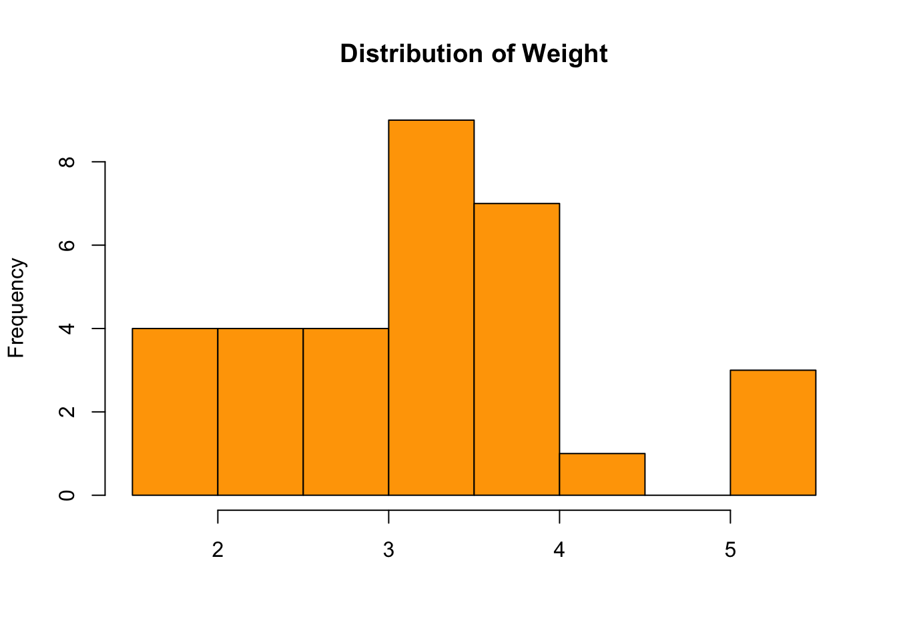
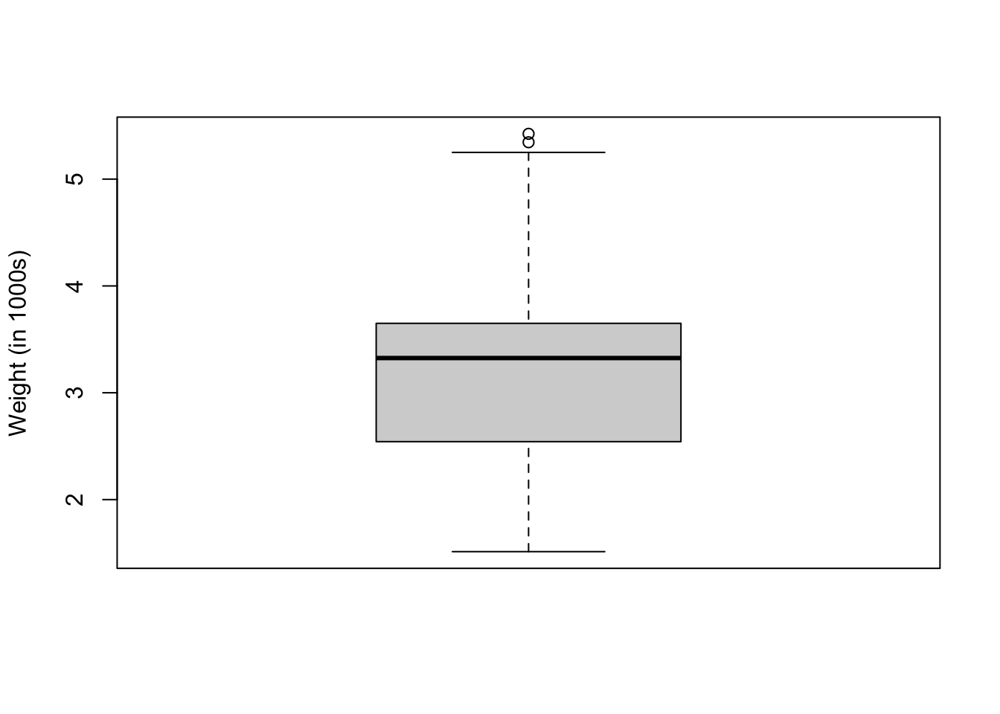

**Introduction to Statistical Computing with R**


Based on notes by Paul Thibodeau (2009) and revisions by the Psych 252 instructors in 2010 and 2011

Expanded in 2012 by Mike Frank, Benoit Monin and Ewart Thomas

Converted to [R Markdown](http://www.rstudio.com/ide/docs/r_markdown) format and further expanded in 2013 by Michael Waskom.

2013 TAs: Stephanie Gagnon, Lauren Howe, Michael Waskom, Alyssa Fu, Kevin Mickey, Eric Miller

Adapted in summer 2018 for short RA tutorial by Camilla Griffiths & Juan Ospina.

Adapted, revised, and added upon by Chayce Baldwin fall 2018 for RSC R workshops

Adapted, revised, and added upon by Benjamin Manning spring 2021 for psych 399 and new character lab employees

*If you haven't already installed R, it is available [here](http://cran.us.r-project.org/). Then, [download R Studio](https://www.rstudio.com/products/rstudio/download/).*

Brief notes about learning R
============================

R is a programming language that is specifically designed for statistical computation. It has many appealing features: it is powerful, flexible, and widely used in the statistical community. The aspects that make R so powerful and flexible, however, contribute to a learning curve that is relatively steeper than what you might find in point-and-click packages like SPSS. The aim of this tutorial is to provide a general introduction to interacting with R that will reduce the feelings of frustration and helplessness that can emerge early in ones relationship with it. Although this tutorial doesn't assume any preexisting knowledge, if you've had no experience with computer programming there may be some parts of it that are confusing or lack a particularly deep meaning. Try your best to understand them now, but you will also likely benefit from returning to the tutorial periodically as you become more comfortable.

The most important skill to cultivate up front is the ability to help yourself when you are stuck. Fortunately, R is pretty helpful in this regard. R is what's known as an *interpreted language*, which basically means that there is a console you type commands into and get immediate feedback on them. Do this liberally as you work though the tutorial and the early class exercises, making small modifications to the examples we provide until you feel like you really understand what's going on.

The console is also your gateway to the built-in help functionality. Almost all R functions (more later on what those are) have help files built in that will provide you with useful information about what those functions do and how to use them. You find this by typing `help(function)` (or `?function`), where I am using "function" as a stand-in for the name you actually want to know about. It's important to read these files closely the first time you encounter a function, but it's *also* (possibly more) important to refer back to them frequently. I read once that a prominent distinction between an experienced programmer and a novice is the longer latency for the novice to look up the help for something confusing (but the direction of causality is not clear!). If you have a sense for what you want to do, but don't know or can't remember the exact function that will do it, you can search through the help files for a term with two question marks (e.g. `??regression`).

Of course, the internet is also a useful resource. Because of its name, it can be a little annoying to google for help with R. A useful resource, in my opinion, is the [stackoverflow](http://stackoverflow.com/) website. Because this is a general-purpose resource for programming help, it will be useful to use the R tag (`[R]`) in your queries. A related resource is the [statistics stackexchange](http://stats.stackexchange.com/), which is like Stack Overflow but focused more on the underlying statistical issues.

Finally, a note on errors. Novice and expert programmers alike will frequently run into errors in their R code. When this happens, processing will halt and an error message will be printed to the console. This is usually more frustrating for the novice, as the error often occurs deep within some function and the message bears no direct correspondence to what they were trying to do. A common beginner mistake is to conclude that the error message is gibberish and resign oneself to woe and dismay. It's important to resist this urge; even if the error message is not immediately informative, it is intended to precisely convey some piece of information, and usually understanding what this information is will be the key to solving the problem.

Getting started: Using RStudio and R Markdowns
----------------------------------------------

How are R and RStudio different? RStudio is an interface that lays atop the base program R and is more user-friendly. R, on it's own, is only a console where you can type and run code. RStudio has this *Console* pane, in addition to an *Environment* pane where you can see all the variables and datasets you've saved in your R session, a *Viewer*  pane where you can access your files, view your plots, access your packages, and get help, and a *Source* pane where you can create R Markdown documents. 

What is an R Markdown document? This is the main kind of document that I use in RStudio, and it's the primary advantage of RStudio over base R console. R Markdown allows you to create a file with a mix of R code and regular text, which is useful if you want to have explanations of your code alongside the code itself. This document, for example, is an R Markdown document. It is also useful because you can export your R Markdown file to an html page or a pdf, which comes in handy when you want to share your code or a report of your analyses to someone who doesn't have R. If you're interested in learning more about the functionality of R Markdown, you can visit [this webpage](https://rmarkdown.rstudio.com/lesson-1.html). Also, out of the goodness of their hearts, the team at RStudio literally made a cheat sheet for R Markdowns. [Check it out](https://www.rstudio.com/wp-content/uploads/2015/02/rmarkdown-cheatsheet.pdf). Not only that, they have made cheat sheets for a lot of other things as well...We'll get into those later.

# Basic interaction with the R console


```r
#install.packages("psych", "doBy", "tidyverse") #Once downloaded, comment out
```


At its least useful, you can treat R like a calculator for basic computations. Just type some mathematical expression into your code **chunk**, and the result will be displayed in the console. A **chunk** is designated by starting with ``` ```{r}``` and ending with ``` This is where you will write your code. A new chunk can be created by pressing COMMAND + ALT + I on Mac, or CONTROL + ALT + I on PC.

You can run lines of code from your script by highlighting them, and pressing COMMAND/CONTROL + ENTER on Mac, or CONTROL + ENTER on PC. If you're in an R Markdown document and want to run a whole chunk of code, you can press COMMAND/CONTROL + SHIFT + ENTER on Mac, or ALT + CONTROL + ALT + C on PC.


```r
1 + 2
```

```
## [1] 3
```

```r
13 / 2
```

```
## [1] 6.5
```

```r
2 ^ 6
```

```
## [1] 64
```

```r
5 * (2 + 3)
```

```
## [1] 25
```

PRACTICE: Use the chunk below to practice using R as a calculator.


```r
# Write a mathematical expression with at least three numbers

# Write a mathematical expression with different opperations
```


## Variable Assignment

Of course, R is a programming language, so it is much more powerful than a basic calculator. A major aspect of computing with R involves the assignment of values to variables. There are two (almost) equivalent ways to do this:


```r
x = 4
x <- 4
```

In both cases, `x` will represent `4` for all lines of code below these here, unless you reassign `x`. Note below that adding 2 two `x` will temporarily add 2 to x and print that value. A new value is only made "permanent" when an `<-` or `=` is used. This can be done using previous values of a variable or brand new values!


```r
#print previous x
x
```

```
## [1] 4
```

```r
#print x + 2 (temporary)
x + 2
```

```
## [1] 6
```

```r
#permanently add 2
x <- x + 2
x
```

```
## [1] 6
```

```r
#give x a brand new value unrelated to previous values
x <- 8
x
```

```
## [1] 8
```

It is important not to confuse variable assignment with a statement about equality. In your head, you should say *set x to 4* or *x gets 4*, but not *x is equal to 4*. Don't worry now about the subtle differences between the two assignment styles. Although using `=` is more consistent with the norm in other programming languages, `<-` is the typical practice as it makes the action that is being performed more obvious. Whichever you choose, it's best to be consistent throughout your code. However, they are exactly the same when used correctly

In case you're wondering, you test for equality with two equal signs (`==`), which does something completely different:


```r
#You can do this with numbers
2 == 2
```

```
## [1] TRUE
```

```r
2 == 3
```

```
## [1] FALSE
```

```r
#you can also do it with variables!
x <- 2
y <- 2
z <- 3
x == y
```

```
## [1] TRUE
```

```r
x == z
```

```
## [1] FALSE
```

It's fine to use variable names like `x` for simple math examples like the ones above. But, when writing code to perform analysis, you should be careful to use descriptive names. Code where things are named, `subject_id`, `condition`, and `rt` will be a bit more verbose than if you had used `x`, `y`, and `z`, but it will also make **much** more sense when you read it again 4 months later as you write up the paper.

With that said, there are a few rules for variable names. You can use any alphanumeric character, although the first character must be a letter. You can't use spaces, because the computer doesn't know that you're trying to write a phrase and interprets that as two (or more) separate terms. When you want something like a phrase, the `_` and `.` characters can be employed (this can be a bit confusing as `.` is usually meaningful in programming languages, but not in R).

Here's a simple example that novice coders often find confusing. Walk yourself through the code and make sure you understand what operations lead to the final return value:


```r
a <-  10
b <-  20
a <-  b
print(a)
```

```
## [1] 20
```

That's right, an object will only contain its *most recent* assignment. Even though `a` was originally assigned the value 10, it was then reassigned the value of `b`. 

So far we've only been dealing with numbers, but there are other data types as well.

For instance, we could assign character (aka string) values, with quotation marks:


```r
group_size <- "average"
group_size
```

```
## [1] "average"
```

```r
rsc_name <- "Research Support Center"
rsc_phone <- "8014225114" 
```
Here, even though we used letters for one object and digits for the other, R recognizes both objects as character values. Using quotation marks makes all values into characters.

Do you see how `rsc_phone` changes when we don't use quotation marks?


```r
rsc_phone <- 8014225114
rsc_phone
```

```
## [1] 8014225114
```
Without quotation marks, R recognizes the digits as a number that can be operated on--it can be added, subtracted, etc.

We can also assign logical values, `TRUE` and `FALSE`:


```r
alive <- TRUE
asleep <- FALSE
```

While we're at it, you can also compare numbers with >, <, !=, <=, and >=, which return `TRUE` or `FALSE` as well.


```r
2 < 3
```

```
## [1] TRUE
```

```r
3 <= 3
```

```
## [1] TRUE
```

```r
3 != 4 #-> note: the sign "!=" means "not equal to"
```

```
## [1] TRUE
```

Once you've assigned a variable to a value, you can use them in calculations: 


```r
psych <- 0
sociology <- 1
econ <- 1
poli.sci <- 2
sfl <- 3


fhss_n = psych + sociology + econ + poli.sci + sfl 
fhss_n # print the result for the total number of FHSS students
```

```
## [1] 7
```


Using functions
---------------

Another core concept involves using **functions** to perform more complex operations. **Functions** in R work like they do in mathematics: they take one or more inputs (called *arguments* or *parameters*), perform a certain operation, and then produce one or more outputs (or *return values*). You *call* a function by writing its name followed by parentheses, with any arguments going inside the parentheses. We already saw one example of this with the `print()` function above. The `cat()` function is similar, but it converts its arguments into characters first. There are also some basic mathematical functions built into R that operate on numbers:


```r
abs(-4)
```

```
## [1] 4
```

```r
sqrt(64)
```

```
## [1] 8
```

```r
log(1.75)
```

```
## [1] 0.5596158
```

A frequently-used function is `c()`. This takes a sequence of arguments and sticks them together into a **vector**, which we'll explain a little bit more about below. All you need to know now is that most of the built in functions for descriptive statistics (and there are many of these!) expect to receive a vector or something like it.


```r
a <- c(1.5, 4, 3)
cat(a)
```

```
## 1.5 4 3
```

```r
sum(a)
```

```
## [1] 8.5
```

```r
mean(a)
```

```
## [1] 2.833333
```

```r
sd(a) #Reports standard deviation
```

```
## [1] 1.258306
```

Applied example: **(Just Camilla)**


```r
# Create vectors for the forecasted high temperatures for San Francisco and Palo Alto over the next week:
provo_highs <- c(83, 91, 96, 94, 89, 85, 84)
slc_highs <- c(80, 85, 95, 89, 82, 77, 81)

provo_highs
```

```
## [1] 83 91 96 94 89 85 84
```

Now we can do things like find the mean temperatures (`mean()`) and standard deviation temperatures (`sd()`. We could also look at each vector's `length()`, its `max()` or `min()` values, or its `median()` or `range()`.


```r
mean_slc <- mean(slc_highs) #creates a new variable called mean_sf
sd(slc_highs) #prints the sd of the sf_highs vector in the console
```

```
## [1] 6.12178
```

```r
mean_pa <- mean(provo_highs)
sd(provo_highs)
```

```
## [1] 5.080307
```


APPLY YOUR KNOWLEDGE:

1. Find the median and range for these vectors.
2. Find the length of the vectors. What does the length refer to? 
3. On average, how much warmer will Provo be than SLC over the next week?


```r
#median & range

#length

#mean difference between Provo & SLC over the next week
```

These built-in functions are useful for many reasons, but often we're dealing with more data than a single vector, and we want to do more with it than calculate summary statistics. Next, we'll cover how to import data into R and how to work with it once it's in here. If possible, you want to stay away from manipulating anything in your data outside of R (in Excel, for example) because it's difficult to keep track of changes that you make. In R, your code acts as a trace of every little thing you've done to your data, so you can always undo something if needed or revert back to the data's original form. 

# Importing Data

When we run a study and collect data, we'll usually end up with a .csv file that has one row per participant and one column per survey question or variable. We want to import this into R so we can do things like rename variables, calculate summary statistics for many of the survey questions (e.g. how old, on average, were the participants?), and visualize and analyze some of the trends in the data. 


```r
library(tidyverse)
```

```
## ── Attaching packages ──────────────────────────────────────────────────────────────────────────────── tidyverse 1.3.0 ──
```

```
## ✓ ggplot2 3.3.3     ✓ purrr   0.3.4
## ✓ tibble  3.0.3     ✓ dplyr   1.0.2
## ✓ tidyr   1.1.2     ✓ stringr 1.4.0
## ✓ readr   1.4.0     ✓ forcats 0.5.0
```

```
## ── Conflicts ─────────────────────────────────────────────────────────────────────────────────── tidyverse_conflicts() ──
## x dplyr::filter() masks stats::filter()
## x dplyr::lag()    masks stats::lag()
```

```r
# write csv
write_csv(mtcars, "mtcars.csv")

#file.choose() #Use this function to specify file path of data file

# load a csv file
d <- read_csv("mtcars.csv")
```

```
## 
## ── Column specification ─────────────────────────────────────────────────────────────────────────────────────────────────
## cols(
##   mpg = col_double(),
##   cyl = col_double(),
##   disp = col_double(),
##   hp = col_double(),
##   drat = col_double(),
##   wt = col_double(),
##   qsec = col_double(),
##   vs = col_double(),
##   am = col_double(),
##   gear = col_double(),
##   carb = col_double()
## )
```

You can also import data from other programs like Stata or SPSS using the package `haven`:


```r
library(haven)

haven::write_dta(mtcars, "mtcars.dta")
d2 <- haven::read_dta("mtcars.dta")

haven::write_sav(mtcars, "mtcars.sav")
d3 <- haven::read_sav("mtcars.sav")
```


Once you've imported your datafile, you'll want to take a look at your data set to make sure you have imported it correctly:


```r
#look at the names of all the variables in your dataset
names(d)
```

```
##  [1] "mpg"  "cyl"  "disp" "hp"   "drat" "wt"   "qsec" "vs"   "am"   "gear"
## [11] "carb"
```

```r
#get summary information about all the variables in your dataset (e.g. number of observations, number of missing values, minimum value, max value)
summary(d)
```

```
##       mpg             cyl             disp             hp       
##  Min.   :10.40   Min.   :4.000   Min.   : 71.1   Min.   : 52.0  
##  1st Qu.:15.43   1st Qu.:4.000   1st Qu.:120.8   1st Qu.: 96.5  
##  Median :19.20   Median :6.000   Median :196.3   Median :123.0  
##  Mean   :20.09   Mean   :6.188   Mean   :230.7   Mean   :146.7  
##  3rd Qu.:22.80   3rd Qu.:8.000   3rd Qu.:326.0   3rd Qu.:180.0  
##  Max.   :33.90   Max.   :8.000   Max.   :472.0   Max.   :335.0  
##       drat             wt             qsec             vs        
##  Min.   :2.760   Min.   :1.513   Min.   :14.50   Min.   :0.0000  
##  1st Qu.:3.080   1st Qu.:2.581   1st Qu.:16.89   1st Qu.:0.0000  
##  Median :3.695   Median :3.325   Median :17.71   Median :0.0000  
##  Mean   :3.597   Mean   :3.217   Mean   :17.85   Mean   :0.4375  
##  3rd Qu.:3.920   3rd Qu.:3.610   3rd Qu.:18.90   3rd Qu.:1.0000  
##  Max.   :4.930   Max.   :5.424   Max.   :22.90   Max.   :1.0000  
##        am              gear            carb      
##  Min.   :0.0000   Min.   :3.000   Min.   :1.000  
##  1st Qu.:0.0000   1st Qu.:3.000   1st Qu.:2.000  
##  Median :0.0000   Median :4.000   Median :2.000  
##  Mean   :0.4062   Mean   :3.688   Mean   :2.812  
##  3rd Qu.:1.0000   3rd Qu.:4.000   3rd Qu.:4.000  
##  Max.   :1.0000   Max.   :5.000   Max.   :8.000
```

```r
#look at the first 10 observations
head(d)
```

```
## # A tibble: 6 x 11
##     mpg   cyl  disp    hp  drat    wt  qsec    vs    am  gear  carb
##   <dbl> <dbl> <dbl> <dbl> <dbl> <dbl> <dbl> <dbl> <dbl> <dbl> <dbl>
## 1  21       6   160   110  3.9   2.62  16.5     0     1     4     4
## 2  21       6   160   110  3.9   2.88  17.0     0     1     4     4
## 3  22.8     4   108    93  3.85  2.32  18.6     1     1     4     1
## 4  21.4     6   258   110  3.08  3.22  19.4     1     0     3     1
## 5  18.7     8   360   175  3.15  3.44  17.0     0     0     3     2
## 6  18.1     6   225   105  2.76  3.46  20.2     1     0     3     1
```

```r
#look at the last 10 observations
tail(d)
```

```
## # A tibble: 6 x 11
##     mpg   cyl  disp    hp  drat    wt  qsec    vs    am  gear  carb
##   <dbl> <dbl> <dbl> <dbl> <dbl> <dbl> <dbl> <dbl> <dbl> <dbl> <dbl>
## 1  26       4 120.     91  4.43  2.14  16.7     0     1     5     2
## 2  30.4     4  95.1   113  3.77  1.51  16.9     1     1     5     2
## 3  15.8     8 351     264  4.22  3.17  14.5     0     1     5     4
## 4  19.7     6 145     175  3.62  2.77  15.5     0     1     5     6
## 5  15       8 301     335  3.54  3.57  14.6     0     1     5     8
## 6  21.4     4 121     109  4.11  2.78  18.6     1     1     4     2
```

```r
#look at all the variable types of all the variables in your dataset
str(d)
```

```
## tibble [32 × 11] (S3: spec_tbl_df/tbl_df/tbl/data.frame)
##  $ mpg : num [1:32] 21 21 22.8 21.4 18.7 18.1 14.3 24.4 22.8 19.2 ...
##  $ cyl : num [1:32] 6 6 4 6 8 6 8 4 4 6 ...
##  $ disp: num [1:32] 160 160 108 258 360 ...
##  $ hp  : num [1:32] 110 110 93 110 175 105 245 62 95 123 ...
##  $ drat: num [1:32] 3.9 3.9 3.85 3.08 3.15 2.76 3.21 3.69 3.92 3.92 ...
##  $ wt  : num [1:32] 2.62 2.88 2.32 3.21 3.44 ...
##  $ qsec: num [1:32] 16.5 17 18.6 19.4 17 ...
##  $ vs  : num [1:32] 0 0 1 1 0 1 0 1 1 1 ...
##  $ am  : num [1:32] 1 1 1 0 0 0 0 0 0 0 ...
##  $ gear: num [1:32] 4 4 4 3 3 3 3 4 4 4 ...
##  $ carb: num [1:32] 4 4 1 1 2 1 4 2 2 4 ...
##  - attr(*, "spec")=
##   .. cols(
##   ..   mpg = col_double(),
##   ..   cyl = col_double(),
##   ..   disp = col_double(),
##   ..   hp = col_double(),
##   ..   drat = col_double(),
##   ..   wt = col_double(),
##   ..   qsec = col_double(),
##   ..   vs = col_double(),
##   ..   am = col_double(),
##   ..   gear = col_double(),
##   ..   carb = col_double()
##   .. )
```

```r
#pull up the whole dataset in a new tab in Rstudio. When knitting the markdown, you can't use this function since the markdown doesn't know how to show the dataset in the final report (the html document).
# View(d)
```

For preloaded datasets in R, you can find out more about your data and what the variables mean by typing `?[datasetname]` into the console. `mtcars` is a preloaded dataset, so take a look at the help page for this dataset to learn about the variables and what they mean. 

## Data types 

There are four main data types that you'll run into in R. It's important to be familiar with them because it will help to understand and debug some of the errors you'll run into. The four data types are: 

1. Numeric (numbers, integers, doubles)
2. Character (strings)
3. Logical (true/false)
4. Factor (discrete levels; e.g., categories as would be used in ANOVA, such as male and female)

If you re-run the `str(d)` code from above, you'll notice that the output displays the data type for each variable. If you want to change the type of a variable to a factor, for example, you can use the function `as.factor()`. You'll see an example of this below. 


```r
str(d)
```

```
## tibble [32 × 11] (S3: spec_tbl_df/tbl_df/tbl/data.frame)
##  $ mpg : num [1:32] 21 21 22.8 21.4 18.7 18.1 14.3 24.4 22.8 19.2 ...
##  $ cyl : num [1:32] 6 6 4 6 8 6 8 4 4 6 ...
##  $ disp: num [1:32] 160 160 108 258 360 ...
##  $ hp  : num [1:32] 110 110 93 110 175 105 245 62 95 123 ...
##  $ drat: num [1:32] 3.9 3.9 3.85 3.08 3.15 2.76 3.21 3.69 3.92 3.92 ...
##  $ wt  : num [1:32] 2.62 2.88 2.32 3.21 3.44 ...
##  $ qsec: num [1:32] 16.5 17 18.6 19.4 17 ...
##  $ vs  : num [1:32] 0 0 1 1 0 1 0 1 1 1 ...
##  $ am  : num [1:32] 1 1 1 0 0 0 0 0 0 0 ...
##  $ gear: num [1:32] 4 4 4 3 3 3 3 4 4 4 ...
##  $ carb: num [1:32] 4 4 1 1 2 1 4 2 2 4 ...
##  - attr(*, "spec")=
##   .. cols(
##   ..   mpg = col_double(),
##   ..   cyl = col_double(),
##   ..   disp = col_double(),
##   ..   hp = col_double(),
##   ..   drat = col_double(),
##   ..   wt = col_double(),
##   ..   qsec = col_double(),
##   ..   vs = col_double(),
##   ..   am = col_double(),
##   ..   gear = col_double(),
##   ..   carb = col_double()
##   .. )
```


```r
d$am <- as.factor(d$am)
str(d$am)
```

```
##  Factor w/ 2 levels "0","1": 2 2 2 1 1 1 1 1 1 1 ...
```
The variable `am` tells us whether the cars have automatic transmission or not (automatic = 0, manual = 1). Because these are really categories represented by 0 and 1, rather than meaningfully continuous numbers, we used the function `as.factor()` to tell R that `am` is a factor. You can check that the transformation was successful using `str(variable_name)`.

## Looking at your data

Though it can be useful to look at our data as a whole, we are usually interested in looking at specific variables in our dataset. We can access those variables with this code: `dataset$var_name`--the dataset, a dollar sign, and then the variable name. For example, `d$cyl` would be understood as **"the variable `cyl` within the dataset `d`"**. Because we may have multiple data frames in the environment at once (e.g., full datasets, subsets, etc.), it is important that we specify which data frame the variable is in so that R knows where to find it.

### Attaching Dataframes

Sometimes, though, if you're going to be working with one dataframe for a while, it can be helpful to **attach** the dataframe while you're working, and then **detach** it when you're done. When a dataframe is attached, you can just type in the name of the variable, and R will know to look in the attached dataframe.

*Keep in mind that while this can be convenient for interactive analyses, it can be a source of tricky bugs (where names overlap) and should be used with caution and discretion.* 

Here, we attach the data frame and then do the same operation that we just did with the variable `am`:


```r
attach(d)
```

```
## The following object is masked from package:ggplot2:
## 
##     mpg
```

```r
am <- as.integer(am)
str(am)
```

```
##  int [1:32] 2 2 2 1 1 1 1 1 1 1 ...
```

```r
am <- as.factor(am)
str(am)
```

```
##  Factor w/ 2 levels "1","2": 2 2 2 1 1 1 1 1 1 1 ...
```

Make sure you remember to detach the dataframe when you're done, otherwise R can get confused if you work with a different dataframe with similar variables!


```r
detach(d)
```

### Checking out your variables

Now that we can access the variables, we can explore them using a number of functions. Along with the basic statistical functions we described above (e.g., `mean()`, `sd()`, `range()` etc.), there are some more comprehensive functions we can use to look at summary statistics. You may notice below that some of these useful functions come from the *psych* and *doBy* R packages. For now, don't worry too much about packages; we will go over them more in-depth in the second R workshop.


```r
library(psych)
```

```
## 
## Attaching package: 'psych'
```

```
## The following objects are masked from 'package:ggplot2':
## 
##     %+%, alpha
```

```r
tapply(d$mpg, d$gear, mean) #mean mpg for cars with each possible amount of gears--3, 4, or 5
```

```
##        3        4        5 
## 16.10667 24.53333 21.38000
```

```r
sapply(d, mean) # means for each variable in the dataset
```

```
## Warning in mean.default(X[[i]], ...): argument is not numeric or logical:
## returning NA
```

```
##        mpg        cyl       disp         hp       drat         wt       qsec 
##  20.090625   6.187500 230.721875 146.687500   3.596563   3.217250  17.848750 
##         vs         am       gear       carb 
##   0.437500         NA   3.687500   2.812500
```

```r
summary(d$mpg) #basic summary statistics
```

```
##    Min. 1st Qu.  Median    Mean 3rd Qu.    Max. 
##   10.40   15.43   19.20   20.09   22.80   33.90
```

```r
describe(d$hp) #"describe" function from "psych" package; more in-depth summary statistics
```

```
##    vars  n   mean    sd median trimmed  mad min max range skew kurtosis    se
## X1    1 32 146.69 68.56    123  141.19 77.1  52 335   283 0.73    -0.14 12.12
```

```r
table(d$carb, d$am) #table of frequencies
```

```
##    
##     0 1
##   1 3 4
##   2 6 4
##   3 3 0
##   4 7 3
##   6 0 1
##   8 0 1
```

```r
addmargins(table(d$carb, d$am, dnn=c('# of Carburetors','Transmission'))) #adding more info to table
```

```
##                 Transmission
## # of Carburetors  0  1 Sum
##              1    3  4   7
##              2    6  4  10
##              3    3  0   3
##              4    7  3  10
##              6    0  1   1
##              8    0  1   1
##              Sum 19 13  32
```

```r
# Taking a look at the distribution
hist(d$wt, col = 'orange', xlab = NA, main = 'Distribution of Weight')
```



```r
boxplot(d$wt, ylab = 'Weight (in 1000s)')
```



Note that for many of these functions, the only specifications *required* within the parentheses is the variable name. Can you guess what the options `col =`, `xlab = `, `main = `, and `ylab = ` mean? 


You can also look at values for certain *groups* in your data. Below are a few functions that mirror the output from above, but give us the summary statistics based on different groups of the variables. Here, we use `describeBy`, from the "psych" package. It gives us summary statistics of the variable `mpg` for each group of `am`.


```r
describeBy(d$mpg, d$am) # from the "psych" package
```

```
## 
##  Descriptive statistics by group 
## group: 0
##    vars  n  mean   sd median trimmed  mad  min  max range skew kurtosis   se
## X1    1 19 17.15 3.83   17.3   17.12 3.11 10.4 24.4    14 0.01     -0.8 0.88
## ------------------------------------------------------------ 
## group: 1
##    vars  n  mean   sd median trimmed  mad min  max range skew kurtosis   se
## X1    1 13 24.39 6.17   22.8   24.38 6.67  15 33.9  18.9 0.05    -1.46 1.71
```

A slightly more complicated, but useful example of grouping statistics is the function `xtabs()`. The code can be understood as meaning "the mean of `mpg`, for each group created by `cyl` by `am`". Because `cyl` has 3 groups and `am` has 2 groups, `xtabs()` will return a 6-cell table with the means of `mpg` for each of those groups; this can be useful for eyeballing differences in means. Notice also that we were able to use the option `data = dataset` (here, data = d) instead of `dataset$variable_name` to individually call each of the variables used in the function. 


```r
xtabs(mpg ~ cyl + am, data = d)
```

```
##    am
## cyl     0     1
##   4  68.7 224.6
##   6  76.5  61.7
##   8 180.6  30.8
```


`summaryBy`, from the *doBy* package, is similar to `xtabs()`: it gives some summary statistic for each level of a grouping variable. However, it doesn't give its output in a table. Also, as you see here, it can return values for multiple variables at once (for example, we are given means for both `mpg` and `carb`).


APPLY YOUR KNOWLEDGE:

1. Find the the mean and standard deviation of var.a and var.b.
2. Find the length of the vectors. What does the length refer to? 
3. On average, how much warmer will Provo be than SLC over the next week?

*Remember:* If you are not sure how to do something, try using the `??subject` function.


```r
#median & range

#length

#mean difference between Provo & SLC over the next week
```

# Recap

## What we learned in this workshop

Today, we learned a few things to get you started in using R:

*   How to download R and R studio
*   How to begin using an R Markdown
*   Basic functions in R
*   How to import data into R and view that data
*   How to look at summary statistics for individual variables


## Continuing your R education

Once you feel comfortable with the material in this workshop, we encourage you to [sign up](https://fhssrsc.byu.edu/Pages/R-Tutorial.aspx) for the second and third R workshops in this series, or [check out](https://fhssrsc.byu.edu/Pages/R-Tutorial.aspx) the materials for those workshops.

In the **second workshop** we go into depth about how to manipulate your data and start to capitalize on the power of packages in R. In the **third workshop**, we explore common ways in which you can analyze data in R, and how you can use powerful packages such as *ggplot2* to visualize your data.

Also, as you know, data is the engine behind change. In return for these workshops, we ask that you please take a short feedback survey to help us improve our workshops for students in the future.

Thank you!!


