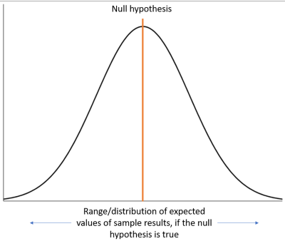
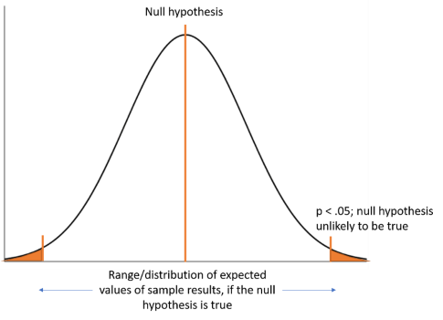

```{r loading packages, include=FALSE}

library(tidyverse) # For dplyr, ggplot2, etc.
library(magrittr) # for pipes

```

# Before we get started

*Having trouble remembering what exactly an R Markdown is? Want some more resources for learning R?*

-   Review what an R Markdown is [here](#markdown).
-   Explore further resources for learning R [here](#resources).

## Recap: What we learned in the previous tutorial

In the last tutorial, we learned about some important aspects of preliminary analyses: outliers and psychometrics. Here's what we went over:

-   Univariate and multivariate (i.e., 2+ variables) outliers
-   Reliability: Alpha and Omega
-   Factor structure: Factor and parallel analyses

## Bird's eye: where we've been and where we're going

Okay, as you're reading this, I want you to have my favorite song playing in the background. It's LITTTTY. https://www.youtube.com/watch?v=KybAvaM3b90. I know you're gonna love it ;)

Over the past 5 weeks, we have learned how to load, clean and manipulate, visualize, and preliminarily (is this a word? idk, but I like it!) analyze our data. Up until now, we have done very little actual statistical analyses. But isn't the whole point to analyze our data? Yes, it is--and analyzing our data is less meaningful, less robust, and less informative if we don't do the equivalent to our 5 weeks of work first. Analyzing data when you haven't dived in and cleaned it is a dangerous game! That is why it took us so long to get to this point. Before doing ANY analysis, you should always be immersed in your data - sleeping in it, playing with it- knowing everything about it!

Think of it like baking: say we want to bake a pot pie. We'll use the process of making the pot pie to represent analyzing our data. What do we have to do before you bake the pot pie? Well, we have to get your ingredients (aka load in data) and we have to prep those ingredients: dice our chicken, cut up carrots, etc. (aka manipulate data). Sometimes before we bake, we have to do a little cooking, too, to best prepare ingredients--for example, we may need to cook our chicken on the stove before baking it in the pie (aka preliminary analyses). Last, but definitely not least, we have to make sure the pie looks like what we want/expect it to (aka visualizing to see what our data looks like). *Only then* can we bake the pie. And of course, we can't just bake haphazardly--we have to know *how* to bake it: temperature and time (aka know what models to use). I like berry pies, although all pies are good. I don't like pie charts - they're dumb and uninteresting IMO. What kind of pie do you like?

We've done all the prep. We're now at the baking stage. For the next four workshops, we are going to be going through some common analytic methods, when to use them, how to compute them in R, and how to visualize results from each of those models. Here's what we'll look at:

1.  Group difference testing
2.  Correlation and regression
3.  Mediation and moderation
4.  Non-parametric regression

One important thing we will learn, along with how to compute and interpret these tests in R, is *how to choose* the test to analyze your data. After all, if we don't know *when* to use each test, there's not much use in knowing *how* to use them. We'll go into this in more depth, but there are 3 things to consider when choosing how to analyze your data:

1.  What result do you want?
2.  What type of data is your dependent variable?
3.  Once finding the test that will get you that result and works with that dependent variable, are the assumptions met?

For the trillionth time, choosing what analysis to perform is a subjective and challenging choice! There is no *right* answer a lot of the time, but there is often a *better* answer.

Over the coming weeks, we will use these three questions to explore and define when and how to use each model we discuss.

## Overview: What we'll learn here

This week, we'll start our modeling series by learning about group difference testing. As you might guess, **group difference tests** are modeling methods for assessing average differences between groups or categories.

What we'll look at here:

-   [Student's t-tests](#ttest)

    -   single sample t-test
    -   two sample t-test
    -   paired t-test

-   [Analysis of variance](#anova)

    -  One way ANOVA
    -  ANCOVA

# ANOTHER Before we begin: A brief overview of hypothesis testing

Before we dig into how and when to run t-tests and ANOVAs in R and how to interpret the output, we need to understand hypothesis testing. Hypothesis testing is an integral part of pretty much all statistical tests (AND SCIENCE!!!) that we'll discuss over the coming weeks, and the basis of group difference testing. So, then, what is hypothesis testing?

**Hypothesis testing** is the way in which we statistically determine the probability that a given hypothesis is true. Generally, the hypothesis we are interested in is whether there is a *real difference* between a set of two or more populations or between a population and some standard. Determining whether two things are different is the basis of normal statistical testing and the ever-present idea of "statistical significance". However, we can never be 100% sure whether a difference we observe in our data represents a *true* difference that exists in the real world, or just some random-chance difference in our data. Unfortunately, science and statistics don't have the tools to deal with that, either. Technically we can never and if you're interested in an even more intense debate, you should google *Frequentist versus Bayesian Statistics* to learn how even the fundamental ideals of stats are constantly being debated.

How, then, do we test whether there is or isn't a difference, if we can't prove it? Well, we have to use a couple of workarounds. Our workarounds use some good old-fashioned logic and probability to test whether our results represent *true* differences that exist in the real world, or just random-chance differences in our data.

Our first workaround is testing the **null hypothesis** rather than the **alternative hypothesis**. The **null hypothesis**, simply, is that there is *no real difference* between a set of two or more populations or between a population and some standard. The **alternative hypothesis** is that there *is* a real difference. Why test this weird, backwards hypothesis that there is no difference if we are interested in if there really *is* a difference? Here's where the logic comes in. Think about it: How would one go about claiming that they found a real difference? How big would the difference have to be for it to be "real"? Because we can't know the real difference, and it's fairly arbitrary to try and guess what it is, this doesn't seem like a promising approach. However, if we test the null hypothesis--that there's no difference--we just have to know how big "no difference" is. And that's easy: zero. So, we can better test whether there is no difference (an exact value) rather than if there is a real difference (an uncertain value).

Our second workaround is testing the *probability* that there is no difference, rather than testing whether or not there is no difference *directly*. Why? Well, like we said before, we can't test it directly. But we *can* test whether it is more or less probable. By testing this probability, we can start to make some headway on providing evidence for or against our hypothesis. If it is *really* not probable that there is no difference (horrible, horrible double negative), we can **reject the null hypothesis** that there is no difference, and therein provide some evidence that there *is* a difference.

How can we test the probability? First, in line with our hypothesis above, we assume the null hypothesis is true. So, we want to test the probability that we would observe the difference in our data, *if* the null hypothesis was true. But why would we observe a value *other than* the null hypothesis (aka that the difference is zero), if the null were true? Good question. Here's why: our sample data only approximates the population. Because we are only *approximating* what is really happening in the population with our sample, it's unlikely we would hit the true value for the population--there will always be some random error. So, because of random error, even if the null hypothesis is true, we can expect the difference we observe to be somewhere more or less than zero, and that there would be a distribution/range of values we could expect the difference to fall under. Graphically, it would look something like this:



With the knowledge that, if the null hypothesis is true, our result will probably deviate from the null hypothesis to some extent within an expected range of values, we can now test the probability. To test the probability, we measure how far above or below our result is from the null hypothesis, and then, based on that expected distribution or range around the null hypothesis, come up with how probable it is that we would see our result that distance out. The probability we come up with is called the **p-value**. In more exact terms, a **p-value** is "the probability of obtaining a value *at least as extreme* as the one from the data, assuming the model assumptions [we'll talk more about these later] and the null hypothesis are true." So, "p < .10" would mean "the probability of observing this value or a more extreme value is .10, assuming the null hypothesis, the expected spread about that null hypothesis, and other assumptions are true." Another way of thinking about this is in terms of re-sampling. If we were, hypothetically, to re-run our study 100 times, we would probably get slightly different results each time. So, "p < .10" is saying that if the null hypothesis (and other assumptions) is true, and we re-ran our study 100 times, we would get our result or a more extreme result 10 times, just from random chance.

This possibility of random chance results poses us with a problem. As scientists, we want to be as sure as we can about our conclusions, and reduce the possibility (and probability) that our results are random chance. So, in order to confidently reject the null hypothesis that there is no difference, we opt for a pretty small cut-off of the possibility that our result is just random chance: p < .05. "p < .05" means that if we re-ran our study 100 times, we would only observe the result we did, or a more extreme result, 5 times. In general, we say that's extreme enough of a result and low enough of a probability to conclude that the null hypothesis is probably not true--and that there likely *is* some real difference. And here's about how extreme p < .05 looks on a graph:



So, we use p < .05 as a standard for whether we judge an effect as statistically significant or not. In all likelihood, you've probably heard (and most likely also used) this cut-off before. Importantly, though, even though it's a fairly extreme cut-off, it's still arbitrary and shouldn't be seen as black and white conclusive evidence for the presence of a true effect.

There we have it: our method, used in nearly all of our statistical tests, to test our hypotheses and assess how likely it is that our results represent a "true" effect or random chance. At the end of the day, we are basically testing to say if we are "pretty damn sure but never 100% positive that there is a difference between two things"

So, in summary:

-   We use hypothesis tests to test whether there is a real difference between a set of two or more populations or between a population and some standard
-   We do this by testing against the null hypothesis that there is no real difference.
-   We can test against the null hypothesis using a probability distribution and calculating how far away the results in our data are from the null hypothesis. 
-   In general, we use the standard p < .05 as a cutoff for what constitutes "extreme enough" to reject the null hypothesis that there is no difference.

And before we move on, *why* do we care about all of this again? Understanding hypothesis testing is integral to understanding how t-tests (and pretty much all other tests) work. This understanding will inform how we interpret the numbers that R gives us when we run these tests. 

# t-tests in R {#ttest}

As we said above, there are 3 things to consider when choosing how to analyze your data:

1.  What result do you want?
2.  What type of data is your dependent variable?
3.  Once finding the test that will get you that result and works with that dependent variable, are the assumptions met?

In line with those questions, each statistical test we run will (1) give us a certain type of result; (2) only take a certain kind of dependent variable (what we'll call a **dependent variable** assumption); (3) have other assumptions that need to be met for it to work properly.

Let's looks at each of these for t-tests:

**What it gives us**: Computes the difference between two groups

**Dependent variable assumption**: Continuous variable

**Other assumptions**: We'll get to these in a minute...


## What t-tests give us

The **t-test** is the most basic form of comparing differences across groups. This is generally done by comparing the distribution (or **spread**) of two groups and seeing how far away they are from each other. The reason its' called a "t" test is because it uses a t statistic as a way to assess the differences between groups. Of course, now you want to know what a t-statistic is, because that was a wildly unhelpful explanation - we'll get to that/

How does it work? How do we use a t statistic to test differences between groups?

OK, don't get angry at me, but I am going to show you a formula:

$\frac{m_{1} - m_{2}}{SE}$

The t-test. BOOOM Or more specifically, the two sample t-test: The two "m's" stand for the means of two groups, and "SE" stands for the standard error.

So, you take the difference of the two groups and divide by the standard error. This gives us an estimate (the legendary t-statistic) of how far the second mean is from the first mean, taking into account the standard error. Essentially, it asks: "taking into consideration the spread of scores, how far is one group (on average) away from the other group?" Then, we compute a p-value to estimate the probability that this difference is random chance (see hypothesis testing section above).

Real quick side note, what is the standard error? Intuitively and mathematically, the standard error is the standard deviation of the possible values of the t-statistic from our sample. It's stats, we are never positive about anything.

A p value of .05 means that if we were to repeat this process--collect two samples from the population and take the difference of their means--100 times, we would only observe this difference or more extreme 5 times.

Though there are many problems with the assumptions of p values, they are the most generally accepted standard for statistical significance and estimating whether our effect is "real" (beside confidence intervals; we'll get to those next week).

So, we use the t-statistic to calculate a p-value and estimate the probability the difference between groups is random chance.

But on top of "t" and "p", there's one other letter that's important for t-tests. Like all other statistical tests, t-tests also have a measure of effect size. Please don't laugh. The effect size for t-tests is called **Cohen's d**. Cohen's d can be interpreted as the difference in standard deviations between the two groups. For example, a Cohen's d of 1 would mean that there is a one standard deviation difference between the means of the groups. 

This would be quite a large effect, though, in psychology. Here are the normal standards for interpreting Cohen's d:

-   0.2 - Small effect
-   0.5 - Medium effect
-   0.8 - Large effect

We'll get into the different kinds of t-tests in a minute, but in general, they all follow this general form: take the difference of two numbers and then divide by a standard error. Then, we can see how likely it is that if we repeated this process a boat load of times, what is the probability (or number of times out of the total) that we would get the result. And importantly, for each type, you get these three pieces of information: t, p, and d. Also, we get the standard error - which is implicit in these numbers.


## How to run t-tests in R: single sample, two sample, and paired

While understanding what exactly statistical tests are doing and how to interpret them can take some time, running our basic models in R is a breeze.

First, let's read in some data:

```{r}
mtcars <- mtcars
```

`mtcars` is a data set included with R that has some basic data for 32 cars. If you want to learn more about the data set, you can run the code `?mtcars`.

Now, back to t-tests.

The basic function for running t-tests is, wait for itttt, `t.test()`. The arguments of this function can be varied slightly to run different kinds of t-tests.

Also, do you remember that one weird pipe, all those weeks ago, that we've never used, `%$%`? Well, now's your time to try it out. One of the things that `%$%` is useful for is piping data into the functions of many of our common statistical tests, including `t.test()`. So, we'll use it here!

Now, let's try running our three kinds of t-tests:

1.  Single sample t-test

Let's say that the *mean* miles per gallon (`mpg`) for all cars everywhere is 30 mpg. We want to know if our sample of cars is about the same or significantly different from this population average. First, let's see what the sample average actually is:

```{r}
library(psych)

mtcars %>% 
  select(mpg) %>% 
  describe()

```
We can see the mean is 20.09, but the standard deviation is pretty darn big! even though 20 is far different than 30, the standard deviation might have something to say about whether they are actually that different. Who knows???? Does a standard deviation of 6 "outweigh" the difference in 10? The t-test will tell!

Let's test it with a single sample t-test (2 formats with the same result):

```{r}
#with dollar pipe
mtcars %$% t.test(x = mpg, mu = 30)

#without dollar pipe
t.test(x = mtcars$mpg, mu = 30)
```

Single sample t-tests test the mean of a variable against a standard. Sometimes, if known (like in this example), this standard can be a population mean. Because of this, the argument for the standard we are comparing against is `mu`, which represents the Greek letter $\mu$. In statistics, mu is used to signify the population mean, whereas "M" or $\bar{x}$ is generally used to signify the sample mean. These are just random syntax choices that you will simply have to memorize.

You'll notice there are a few different pieces of information that R gives us when we run this t-test. On the first line, it gives us the t statistic, "df", meaning "degrees of freedom" (sample size minus 1; if you haven't already, you'll learn more about this in a statistics course - I'm going to take the easy way out here and not explain it because it's quite unintuitive), and a p-value. Annoyingly, p-values are often presented in scientific notation. However, if it is in scientific notation (like it is here), it's usually pretty small and a significant value less than .05. When in doubt, copy and paste the p-value and see if it's less than 0.05 with one line of code (R accepts scientific notation):

```{r}
1.757e-10 <0.05
```
It's smaller!

You'll also notice that they write out our alternative hypothesis for us--the hypothesis that there *is* a difference. That's pretty nifty! A significant p-value, like we have here, can be understood as rejecting the null hypothesis and providing evidence for the alternative hypothesis that the "true mean is not equal to 30". 

Notice that the t statistic is negative. Because the formula of the single sample t-test subtracts the population mean from the mean of `mpg`, this negative value lets us know that the average `mpg` in our sample is *lower* than the population average. This can be verified on the last line of the output, where it says "Sample estimates: mean of x". Here it is 20.09, indicating that the estimated mean of `mpg` is 20.09--nearly 10 mpg lower than the population average.

Let's try a little practice! How about you check out the variable `disp` in the data set and see what the mean and standard devation are?

```{r}
# practice here
```
Okay - the mean should be around 230, and standard deviation around 124. Hmmmmm, that's a big standard deviation! Let's see if the mean is ACTUALLY 230 with a t test! For some fun, let's see if the mean is different than 240. With such a big standard deviaation, it's hard to know by eyeballing. Perform a t test below with mean = 260 on `disp`.

```{r}
#practice a t-test
```
WOW. That standard deviation is doing a lot of work! The difference is not statisticall significant (p-value should be around .19)

Now back to the mpg example from before `mpg`. So, it looks like mpg of our sample is significantly lower than the population average, but how big is this effect? We know the effect in *unstandardized* units--the units of measurement of variable `mpg`. That's about 10 mpg difference. But, the *standardized* effect can be helpful to know, too, because it is easily comparable across variables. 

Let's compute Cohen's d to see what the standardized effect size is for this analysis. 
The function we will use for Cohen's d doesn't actually compute Cohen's d for single sample t-tests, but this is easy enough to do by hand. All we need to do is subtract the population average from the average of `mpg`, and divide this difference by the standard deviation of `mpg`. Let's try it out:

```{r}

single.samp.d <- (mean(mtcars$mpg) - 30)/sd(mtcars$mpg)

abs(single.samp.d)
```
It looks like there is a very big difference (d = 1.64) between our sample and the population average--a much larger difference than you would see in most psychology studies. You may have also noticed that I took the absolute value of the Cohen's d I computed; generally, we present Cohen's d as a positive value representing only the difference in standard deviations, not the direction of the difference. This is obvious because we can see that 20.09 is less than 30 already without any test!

2.  Two sample t-test

Now that we have an understanding of how our sample `mpg` compares to the population, we're interested in whether there is a difference in `mpg` between manual and automatic transmission cars. First let's look at the numbers:

```{r}
mtcars %>% 
  dplyr::group_by(am) %>% 
  dplyr::summarize(mean(mpg),sd(mpg))

```
So, what we want to know is the following: is the mean mpg for manual cars (17.14) different than the mean mpg for automatic cars (24.39). We can see the standard deviations are quite different and the means are different, so there is a lot of information here! We don't know the answer without the t-test?

QUESTION: Try writing out the null and alternative hypotheses before running the test code (answers below code)

We can test this using a two sample t-test and the following code:

```{r}
#with pipe
mtcars %$% t.test(mpg ~ am)

#without pipe
t.test(mpg ~ am, data = mtcars)

```

ANSWER:
Null: There is NO difference between the mpg of automatic and manual cars. The difference is equal to 0
Alternative: There IS a difference between the mpg of automatic and manual cars. Or see the answer in the R console output.

Two sample t-tests are probably the most common type of t-test and test differences in a continuous variable across two groups. You'll notice here that the code is a bit different than a single sample t-test: rather than a comma, the variables `mpg` (the outcome) and `am` (the group variable) are separated by a `~` (pronounced "tilde"). Why? This is the formula format used in R, which we will be seeing in the code for most statistical tests from here on out. The formula format is as follows:

`(dependent_variable ~ independent_variables)`

This same format will be used for ANOVAs, regressions, and each of their variants, as well. Here, the formula format is used to identify `am` as the grouping variable by which `mpg` is split up and then compared. 

OK, now what do the results say?

The output format is very similar to a single sample t-test, except for a few things. First, the alternative hypothesis will now always be the same: "true difference in means is not equal to 0". Rather than testing against a standard, we are testing whether the difference between means is equal to 0. Second, the sample estimates now give us two numbers--the means for each of the groups. 

The results indicate that there is a significant difference between the groups (p < .05), and, looking at the sample mean estimates, it looks like automatic cars (`am==1`) get about 7 mpg more than manual cars (`am==0`). 

Before we continue, are there any other binary variables of interest that we could see if there's a differeence in `mpg`? It looks like `vs` might be:

```{r}
table(mtcars$vs)
```

Yup! it is. Try doing a t-test to see if there's a difference in `disp` from cars with `vs == 1` and `vs == 0`

```{r}
mtcars %$% t.test(disp ~ vs)
```
There is a VERY significant difference - p-value is around `2.477e-06`. Please interpret this result in words before moving forward. If you are confused - ask during our next lecture session :)

Now, back to `mpg` again. let's compute the effect size, Cohen's d - the standard deviation difference. To do this, we can use the function `cohen.d` in the `effsize` package:

```{r}
#install.packages('effsize')
library(effsize)
mtcars %$% effsize::cohen.d(mpg ~ am)
```

Let's look at the output. "lower" and "upper" refer to the 95% confidence intervals around the estimate of Cohen's d; we'll talk more about confidence intervals next week, so don't worry too much about this now. The number next to "d estimate" is our estimate of Cohen's d: 1.48--another very large effect! It's also nice that they indicate the size of the effect (e.g. "large") next to the estimate of d. Taking this result together with the t-test, there is a significant difference between the mpg for manual and automatic cars, such that automatic cars get 1.48 standard deviations more mpg than manual cars.

3.  Paired t-test

Suppose the mpg measurements for `am` = 0 (manual) and `am` = 1 (automatic) had been taken from the *same* cars, say, in comparing earlier versus later models. That is, the mpg when `am` = 0 is from *before* the transmission of a model was changed to be automatic; the mpg when `am` = 1 is from *after* the transmission was changed. Now, the samples would NOT be independent. Because there are repeated measures for the same cars, the later measurements are *dependent* on the earlier measurements. In this case, the two samples are *paired*. They are different, but only kind of! They changed over time.

As an example, we have a study in which, for each car, mpg is measured BEFORE the transmission was switched and the year AFTER the transmission was switched, with all cars now being automatic. Let's read in the data and take a look at it!:

```{r}
mt_paired <- read.csv("mtcars.paired.csv", header = TRUE)
view(mt_paired)
```

We can see that instead of a dummy variable, there are two columns indicating the `mpg` (`manual` and `automatic`). We will compare these two columns! As always, it's good to check the summary stats to see what ~might~ happen.

```{r}
mt_paired %>% 
  summarize(mean(manual),sd(manual),mean(auto),sd(auto))
```
Similar standard deviations but slightly different means let's see what the t-test says!

At this point, I would ALWAYS like you to write down the null and alternative hypotheses that you are testing. If you don't explicitly know what you're testing, you should NEVER run a test. NEVER. The answers will be in the output of the test for the alternative - you should be able to intuit the answer for the null from that.

This time, as discussed, since the two groups are **paired** (i.e., NOT independent), we must indicate that in `t.test` by specifying `paired = TRUE`. Otherwise, our results will be incorrect.

```{r}
#pipe - why is it a comma for a paired t-test? IDK it just is, such is life working with R
mt_paired %$% t.test(manual, auto, paired = TRUE)

#no pipe - need to specify as columns, no data argument
t.test(mt_paired$manual, mt_paired$auto, paired = TRUE)
```

The output looks very similar to the two sample t-test, except that "paired t test" is now specified at the top, and the sample estimate at the bottom only has one mean. Why does it only have one mean if we are still comparing two groups? Unlike the two sample t-test which takes the difference of the means between groups, the paired t-test calculates the mean of the differences within pairs; in this case, each car's later rating is being compared directly to it's earlier rating. 

There is a significant difference between the earlier and later measurements of `mpg`, such that, on average, cars had about 3.26 more mpg before they switched from manual to automatic. This seems somewhat contradictory to our previous findings that automatic cars, in general, have better gas mileage than manual cars. 

Let's look at the Cohen's d. Like `t.test`, we also need to specify `paired = TRUE` in `cohen.d`, as well:

```{r}
mt_paired %$% effsize::cohen.d(manual,auto, paired = TRUE )
```
Note, foer some reason when doing a paried test with `cohen.d`, you must use a comma instead of a `~`! Idk why, but such is the life of a coder.

Taken together with the t-test output, the results suggest that there was a significant difference between earlier and later measurements of `mpg`, such that cars had about .62 standard deviations more mpg prior to switching their transmission to automatic.

## Assumptions

But is it really that easy? We just plug in our data and it spits out beautiful numbers? Yes...and no. There's one other thing we have to think about.

All statistical analyses have **assumptions** (like we mentioned in the hypothesis testing section). In general, **assumptions** are conditions that must be true for an analysis to work properly. Often times, assumptions are in place to make sure we don't have biased estimates. This goes back to what we discussed with outliers last week: we want to do all we can to make sure our tests give us results that accurately represent our sample. Outliers can skew the data in our sample, and unmet assumptions can create problems with the accuracy or preciseness of our estimates.

Also, all statistical tests have at least one type of assumption in common: a dependent variable assumption. A test's **dependent variable assumption** is the assumption about what type of data the dependent variable is. For example, is it dichotomous? Continuous?

Before we address the general assumptions of the t-test, we need to take a short detour into an assumption that pops up in many of our statistical tests, including t-tests, ANOVA, and regression: The assumption of normality. 

### The most popular assumption: What's the normality assumption about?

Ever heard of the normality assumption? Throughout all time and statistics classes, we learn that our basic parametric tests--like t-tests--rely on the assumption that our variables must be normally distributed.

**Normally distributed** means that if we plot a histogram of all the data points for a given variable (e.g., 300 responses on a well-being question), there will be a bunch of data points distributed around the middle of the variable, and less data points at more extreme values. This makes the histogram shaped like a bell. Exhibit A:

```{r}
exhibit.a <- rnorm(100000)
# In base R
hist(exhibit.a, breaks = 100)
```

As you can see, the "percent of total" (the Y axis) is much higher in the middle, and less around the sides--that is, normally distributed. Explicitly, there are exact metrics for how far away the data is on average from the middle (68-95-99 rule if you've heard of it) that make it very clear what normally distributed data truly is. In this case, roughly 68% of the data is within one standard deviation of the mean, 95% within in 2, and 99.6% within 3!

So, we dutifully test for normality with many fancy statistical tests, making sure the big middle part of the distribution isn't too far to the left or right (what we call **skew**), or weird in any other way. If our variables **aren't** normally distributed enough (the data is not proportionally aligned over the mean), we do log transformations, compute special kinds of t tests, and do everything we can to correct it. 

This assumption seems to be the one that everyone knows and everyone looks out for--always. If you google "normal distributions in nature" you will be SHOCKED to see how much it comes out in the world!

But...have you ever heard of the Central Limit Theorem?

### The magic of the Central Limit Theorem

Don't worry--I won't whip out any formulas (this time).

First, let's define two things: a **population** and a **sample**. A **population** is the entire group that you want to draw conclusions about (e.g., we're studying college students. The population is ALL college students). A **sample** is the specific group that you will collect data from (e.g., students at Penn or ANY subgroup of college students). Since we only have access to a small portion of all college students, we study that small portion and generalize conclusions about the population. By and large, that's how psychological science works.

This is where the Central Limit Theorem comes into play. The Central Limit Theorem deals with the population distribution and the distribution of sample means in that population. The **population distribution** is the distribution of all people in the population, and the **distribution of the sample means** is how the means for all samples from that population are distributed. This would be like taking a sample, computing the mean, sticking that mean on a graph, and doing that for all possible samples of the population, until you have a distribution of all of the means. Now, this is all very theoretical; we can't actually look at either of these distributions when all we have is the measly one sample we put blood, sweat, and tears into collecting. So why does it matter?

Here's why:

The assumption that t-tests rely on is that **the sample mean is normally distributed**. This does **not** mean that your data are normally distributed, it means that the **distribution of sample means** (the one we talked about a second ago) **is** normally distributed.

Well, if it's so theoretical, how will we ever know if it's normally distributed?

The Central Limit Theorem, that's how:

The **Central Limit Theorem** says that "for a large sample size, the mean is approximately normally distributed, regardless of the distribution of the population one samples from."

What? What is this magic? Listen on:

"The Central Limit Theorem applies to a sample mean from any distribution. We could have a left-skewed or a right-skewed distribution. As long as the sample size is large, the distribution of the sample means will follow an approximate Normal distribution." (thanks [smart stat people online](#https://online.stat.psu.edu/stat500/node/511#:~:text=For%20a%20large%20sample%20size,has%20mean%20and%20standard%20deviation%20.) for these quotes)

For a visual explanation of the normal distribution, go [here](https://www.youtube.com/watch?v=rzFX5NWojp0).
For a visual explanation of the central limit theorem, go [here](https://www.youtube.com/watch?v=YAlJCEDH2uY).

P.S. STATQUEST IS AWESOME IF YOU'RE EVER STRUGGLING!!!!

In conclusion:

1.  The assumption is **not** that our data are normally distributed, but that the sample mean is normally distributed.
2.  If our sample size is big enough, the sample mean is normally distributed, **regardless of the population distribution**.

So, our hypothesis testing does not depend on the shape of our sample's distribution **or** the population's distribution, just on the distribution of the sample mean.

But what sample size is "big" enough for the sample mean to be normally distributed? Generally, if our sample size is **greater than 30**, the Central Limit Theorem applies. Why 30? Idk - someone far smarter than me figured it out, just role with it.

**If you have sample size larger than 30, then the assumption that the sample mean is normally distributed is true and your data do not need to be normally distributed.**

If our sample size is **less than 30**, then it is more important to have normally distributed data.

### Assumptions of the t-test

So then, what specific assumptions are there for the t-test?

Assumptions of t-tests:

1.  Normality of the sample means (which we just discussed)

**What it means**: the means of all possible samples should be normally distributed about the **population mean**. According to the Central Limit Theorem, this is generally true for samples > 30. If you don't believe this and understand high level math - googling it to check out the proof. Then again, if you understand the proof, you probably already know the theorem!!

2.  Sample variance should follow a scaled χ2 distribution

**what it means**: Don't worry about it too much, except that it means the variance can't be negative compared to the normal distribution's variance.

For non-normal data (i.e., not normally distributed), the distribution of the sample variance may deviate substantially from a χ2 distribution. However, *if the sample size is large*, the distribution of the sample variance has little effect on the distribution of the test statistic.

3.  Sample mean and sample variance should be statistically independent

**What it means**: This means that in a given *population*, if you were to take all possible samples and plot **all** of the means of these samples against all of the variances of these samples, the means and variances would **not he related**. **This is true if the population is normally distributed**.

Normality of the individual data values is not required if these conditions are met.

4.  A final assumption that **needs** to be met is that the data are continuous.

**what it means**: This means that values in your dependent variable should be numbers (like height or weight) and not discrete categories (like race or ethnicity). There are different tests to run if our dependent variable is discrete, rather than continuous.

#### Two sample t-test assumptions

Here are a couple of additional assumptions for two sample (independent) t-tests:

1.  Equality/homogeneity of variance

**what it means**: The two groups/samples being compared should have the same variance. If the *sample sizes* in the two groups being compared are equal, though, Student's original t-test is highly robust to the presence of unequal variances.

Welch's t-test is insensitive to equality of the variances regardless of whether the sample sizes are similar (we'll talk about this in a minute).

2.  The two samples are independent

**what it means**: This means that the values in your two groups are not dependent on each other. Say, for example, that I am taking a survey at the same time as a friend. I decide that I will respond the opposite of how she responds for every question--if she selects "Strongly Agree" to "I am happy," then I select "Strongly Disagree". I think it's funny, but it has a real, statistical effect: it makes the data dependent. How I answer *depends* on how she answers. If your two groups are two separate groups of people who answer for themselves, they should generally be independent: the scores in one group are not informed by or do not rely on scores in the other group. Obviously, this is not true for the paired t-test, but we are specifically acknowledging this when we say that it's paired!

Most two-sample t-tests are robust to all but large deviations from the assumptions (Robust means that they still work pretty well).

#### Paired t-test assumptions

You might assume that because paired t-tests use two groups--like the two sample t test--it would follow that you also assume there is equality of variance between groups for paired t-tests, as well. But, actually, that's not that important for the paired t-test. Why? Because assumptions for the paired t-test are assumptions about the distribution of **the difference between pairs** not the distributions of the separate values of each pair. So, with that, we have one important extra assumption:

1.  The differences are independent

**what it means**: the scores within pairs *are dependent*, but the differences between scores *are independent*. This means that the difference between your two scores and the differences between Sally's scores should not depend on each other and should be unrelated. In this case, we could literally plot the distribution of the differences:

```{r}
#creating a skewed distribution
exhibit.a <- rnorm(100000)
a <- rnorm( 5000, 0, 2 )
b <- rnorm( 1000, -2, 4 )
skew1 <- c( a, b)
hist( skew1 , freq=FALSE)

#creating another skewed distribution
c <- rnorm( 5000, 0, 2 )
d <- rnorm( 1000, -2, 4 )
skew2 <- c(c,d)
hist( skew2 , freq=FALSE)


hist(skew1 - skew2)

```
As you can see, even though each of the two graphs don't look the bell curve alone - the differences look normal!

### Testing for equal variance

Many of the assumptions of t-tests are fulfilled by the Central Limit Theorem or are not directly testable. But what *can* we test?

Of all of the assumptions, the one we should test for is the equality of variance assumption for two sample t-tests. Now, recall that even though this assumption is important, the two sample t-test is robust to the presence of unequal variance if the sample size between groups is equal. Also, just in general, the two sample t-test is a pretty robust test. 

Two common ways of testing for equality of variance are Bartlett's test and Levene's test. Let's try using both of these to get estimates of equality of variance for our data. Just for kicks, let's also look at the sample size across groups to see if they are equal. 

We can calculate Bartlett's test using the base R function `bartlett.test`. For the Levene test, we need to load in the package `car`, which contains the function `leveneTest` (note that "Test", but not "levene", is capitalized). Both of these functions use the familiar formula format, but, importantly, `leveneTest` will only take factors as grouping variables. `am`, although not a factor, has been operating as a grouping variable for `t.test`, `cohen.d`, and `bartlett.test`. For `leveneTest`, however, it needs to be a factor--you can see how I transformed it into a factor in the `leveneTest` code. For a superb explanation of Bartlett's test, go [here](https://methods.sagepub.com/base/download/DatasetStudentGuide/bartletts-test-gss-2016-r#:~:text=Bartlett's%20test%20of%20Homogeneity%20of%20Variances%20is%20a%20test%20to,in%20variances%20between%20the%20groups.)

Also, what do you think the null and alternative hypotheses are in this case?

```{r}
#install.packages('car')
library(car)

table(mtcars$am)

#if you want to repeat without pipes - you should be able to figure it out ;)
mtcars %$% bartlett.test(mpg ~ am)
mtcars %$% car::leveneTest(mpg ~ factor(am))

```

First of all, our groups aren't particularly even: we have 19 manual cars and 13 automatic cars. Let's check our equality of variance tests to see if we need to change our analysis methods to account for unequal variance.

For both of these tests, a significant p-value indicates that variances are **NOT** equal--we reject the null hypothesis that variances across groups are equal. The p-value for Bartlett's test was p = .07 and the p-value for Levene's test was p = .049. One VERY unofficial rule of thumb is that Bartlett's is better for larger samples and Levene's is better for smaller. This is because of some complex math I will spare you from - google it if you want to be a statistical Sherlock Holmes! In short, this is because Bartlett's test is better for normally distributed data, and more data TENDS to be more normal than a small sample!

In this case, the sample is small as heck - so likely NOT normally distributed - so we will go with Levene's barring more intensive scrutiny. It seems that there is some evidence of unequal variance, and we should probably account for this violation of assumption. 

How can we account for this? As you may recall from the assumptions section, "Welch's t-test is insensitive to equality of variances regardless of whether the sample sizes are similar." 

Welch's t-test is an alternative version of the normal two sample t-test that is robust to inequality of variance, and can be used when that assumption is violated.

But wait...run the normal t-test command one more time...

```{r}
mtcars %$% t.test(mpg ~ am)
```

What did you see? It seems like `t.test` is already computing a Welch t-test!

Let's check the defaults for `t.test` to see if we can get any insight into why that is...

```{r}
?t.test
```

If you look at the documentation for `t.test`, you'll see that the default is that `var.equal = FALSE`. Herein, `t.test` by default computes a Welch t-test. However, if we test for equality of variance and find that the variance *is* equal across groups, then we can use the `var.equal = TRUE` option in `t.test`, which would look like this:

```{r}
mtcars %$% t.test(mpg ~ am, var.equal = TRUE)
```
As you can see this give different results! So, which should you use? That depends on if the variances are equal or unequal!

# ANOVA in R {#anova}

**What it gives us**: Computes any difference between two or more groups

**Dependent variable assumption**: Continuous variable

**What it stands for**: ANalysis Of VAriance (capitals spell anova!)

**Other assumptions**:

ANOVA has the same primary assumptions as a t-test:

1.    Data are normally distributed
2.    Equal variance across groups
3.    Independent observations

Like t-tests, with a large enough sample, the first assumption is fulfilled. Additionally, the third assumption should be true if we sample independent groups (i.e. not overlapping/without replacement) from a random sample. The second assumption can be tested directly, just like with t-tests. Do you remember then names of the tests?

**ANOVA** Is the most basic method for comparing more than 2 groups. While t-tests directly compare the difference between two groups, ANOVAs assess whether there is *any* difference among the groups. Therefore, the null hypothesis when running ANOVAs is that all groups are equal; there are no differences between groups. So, if our ANOVA tells us that there *are* differences among the groups, what then? If there are differences, then we run post-hoc tests to pinpoint where and how the groups are different. **Post-hoc tests** are just follow up t-tests that we run to analyze the pairwise relationships between each level of the groups. 


In general, analyzing an ANOVA in R has a few steps:

1.    Create an ANOVA model object
2.    Summarize ANOVA model object
3.    Computed post hoc follow up tests

Let's see how we can analyze one way ANOVAs and ANCOVAs in R. Please note, ANOVA is one of those things in R that can be done many different ways and with multiple packages doing the same thing! You'll figure out your favorite eventually.

First, let's read in our data and look at it! Always look at your data.
```{r}
gm <- read.csv("growth mindset study_cleaned.csv")
gm %<>% mutate(
  
  group_f = factor(group_f),
  school_f = factor(school_f),
  gender_f = factor(gender_f)
)
view(gm)
```

Notice that I made each of our grouping variables into factors. While some functions (like `t.test`) don't really care if the grouping variable is specified as a factor, the ANOVA functions do. It will analyze the data differently *and give you different results* if your grouping variables are not properly specified as factors. This is just a dumb R thing.

## One way ANOVA

First, let's try a one way ANOVA. A **one way ANOVA** tests whether there are any differences among the groups of *one* independent variable. 

For our growth mindset study, this is a perfect way to test our primary research question: are there any differences in GPA one year later across intervention groups? This could mean that the distribution is different, the mean is different, etc. It's an "is this data different test!"

Let's check it out! GOOOOO TEAM!

First, like with the t-tests, let's assess whether our data maintain the assumption that the variance across groups is equal:

```{r}
gm %$% bartlett.test(gpa ~ group_f)
gm %$% car::leveneTest(gpa ~ group_f)
```

The p-value for each of these tests was well above .05, providing support for the notion that there is no difference in the variance across groups. YAY. The sample is pretty big so if there had been inconsistency, I would've deferred to bartlett's 

Here's how to run an ANOVA. Similar to `t.test()`, our ANOVA function `aov()` (another acronym for "analysis of variance") uses the formula format, in the form of "dependent variable ~ grouping variable". This sets up our ANOVA model. We then save the aov model to an object (what I'm naming "mod1" for "model 1"), because we will be using it for lots of things later. OK, now that we have created our model, let's call it and see what the output looks like:

```{r}
#doing the straight up anova
mod1 <- gm %$% aov(gpa ~ group_f)

mod1
```
Real quick - I'm going to show you another way to do EXACTLY the same thing. This might seem random - but down the road, it will be useful! If you've ever done linear regression (if you haven't don't worry), you can just run a linear regression and then do `anova` on the regression item! I call this a fit because it's a linear fit. When we introduce regression in a future workshop, I'll dive deeper into this. It's just an FYI for now. I like it more because it has a more comprehensive output (including significance) - no summary needed. 

```{r}
#using linear regression to get anova
fit1 <- gm %$% lm(gpa ~ group_f)

anova(fit1)
#just viewing the output for mod1
mod1

```


Hm. Unlike `t.test`, `aov` does not seem to give us the results of the hypothesis test for our ANOVA--it provides some information on the sum of squares, etc. but does not directly test the null hypothesis that there is no difference between groups. 

To get the full results of the analysis for the model, we need to pass our model object, `mod1`, to the `summary()` function. Now it will look the same as `anova(fit1)`!

```{r}
summary(mod1)
```

The added information that the `summary()` function gives us is in the `F Value` and `Pr(>F)` columns. ANOVAs, rather than using a t-statistic, use an F-statistic (given in the `F Value` column) to compute a p-value to test the null hypothesis. Then, the p-value is given in the `Pr(>F)` column. 

It looks as though the results of our test are highly significant, with the scientific notation indicating that the p-value is so small it's practically 0. So, what does this tell us again? This tells us that the differences in GPA across intervention groups are large enough that we can reject the null hypothesis that there is no difference across groups. 

Literally, the F-statistic is the ratio of between group variance as compared to within group variance. Like - it's a legit fraction!

$\frac{between-group-variance}{within-group-variance}$

In other words, does the variable group_f provide any power to predicting GPA as opposed to just using the mean of GPA! If you really know your stuff, the F-test is looking at if the additional R-squared from including the independent variables is statistically significant as opposed to excluding them. If that made 0 sense, don't worry - it's a point for the super ahead nerds (like me ;))

For a little practice, try computing an anova to see if `gender_f` has predictive power in predicting `gpa`? We would want to account for potential biasing gender differencess if we were doing a full grit study.

```{r}
#practice anova here with any syntax you like!
```

It looks like gender doesnt matter (F-value = .315) controlling only for `gender_f`

So now that we know there are differences somewhere between our groups, how do we find out *where* those differences are?

There are a few different methods I like to use to look at differences between groups:

1.    Tukey's post hoc test using `TukeyHSD()`
2.    `emmeans()` and `pairs()` to get estimated means and then do pairwise contrasts

How are these two methods different? Well, they are actually pretty similar, but `TukeyHSD()` is specifically well-suited to be a follow up to an ANOVA, whereas `emmeans()` is a flexible function that can be used to get the estimated values from a wide range of statistical models. 

Let's try them both out and see what they tell us:

```{r}
TukeyHSD(mod1)
```

We can see that the output says it is giving us a 95% confidence limit (aka interval) for multiple comparisons of means. It also reports (following `Fit:`) the model that we specified and fed into the function. Then, there are a number of comparisons--it is computing t-tests between every two-level combination. In this case, there are three possible combinations. When it says "Growth Mindset-Control", for example, it literally means "The mean of the Growth Mindset Condition minus the mean of the Control Condition." We can see how big that difference is in the `diff` column. Because the difference in the first comparison is positive, that means the growth mindset mean on GPA is higher than the control condition. In contrast, as we see in the third comparison, the negative difference means that the self-esteem condition mean is lower than the growth mindset mean.

The next two columns after `diff`, `lwr` and `upr`, give us the lower and upper limits of a 95% confidence interval. And finally, the `p adj` column gives us adjusted p-values for each comparison. These adjusted p-values are in large part the reason why we run a Tukey test, rather than just a ton of individual t-tests. The Tukey test is a conservative test of these relationships, in that it corrects for the increased probability of finding a random-chance effect the more tests we run. Remember that if we ran our study 100 times, p < .05 means we would get an effect 5 times just by random chance? The Tukey test (and other corrections, like the Bonferroni correction), tries to reduce the likelihood of finding fake, random effects when we run many tests at once. 

Now lets look at the output for `emmeans()`. `emmeans()` takes as an argument first the model that we specified earlier `mod1`, and second the grouping variable that has the levels we want estimated means for. Notice that the second argument uses a `~`, as a sort of shorthand to indicate that this is variable that is on the right side of your formula in your model.

```{r}
#install.packages("emmeans")
library(emmeans)

emmeans(mod1, ~group_f)
```

`emmeans()` gives us something that `TukeyHSD()` didn't: it gives us the estimated means for each of the groups, not just the differences between those means. We can see that the estimated mean for the growth mindset condition is much higher (87) than the self-esteem (82.9) or control (81.6) conditions. 

Now, similar to `TukeyHSD()` we can compute the difference between each of these means to see if the differences are statistically significant. We do this by adding the `pairs()` function to `emmeans()`:

```{r}
emmeans(mod1, ~group_f) %>% pairs()
```

If you compare this output to the `TukeyHSD()` output, it's very similar! In fact, at the bottom of the output for `pairs()` they note that the contrasts/comparisons are even done using the Tukey method for corrections. One difference in presentation, however, is that `pairs()` gives information on the standard error  (`SE`), degrees of freedom (`df`), and t-value (`t.ratio`), whereas `TukeyHSD()` gives information on the confidence intervals. The method of computation is very similar--just slightly different outputs! Choose the one you think is prettier - it doesn't matter.

Now, while those tests are necessary, it can sometimes be hard to internalize and "get" the main result by staring at a million different comparisons. This is where the power of visualization comes in! Let's use `ggplot` to create a graph representing these results.

You say "GG" I say "Plot"

You: "GG!!!!!"
Ben: "PLOT!!!!"

You: "GG!!!!!"
Ben: "PLOT!!!!"

Together: "YAYYYYYYY"

Remember how we used `group_by()` and `summarise()` to create group means which we could then plot? (like this:)

```{r}
gm %>% 
  group_by(group_f) %>% 
  summarise(mean = mean(gpa), sd = sd(gpa))
```

Well, when we want to plot model results (as opposed to raw means), `emmeans()` can give us similar information, estimated from the model, that we can then use to plot. Just like we did above, we use the function `emmeans()`, but then convert it into a data table using `as.tibble()`. FYI - tibble is basically the same as a data table in R. It's just a weird they made up with some properties that are unimportant right now. Don't worry about it at the moment! We then save that new table into an object:

```{r}
emmeans_anova <- emmeans(mod1, ~group_f) %>% as.tibble()
emmeans_anova
#This commented out code also works with a data frame! One has an index, the other doesn't.
#emmeans_anova <- emmeans(mod1, ~group_f) %>% as.data.frame()
#emmeans_anova
```

You can see that we now have information on estimated means, standard errors, and confidence intervals for each group. 

Now let's use that new data table to create a ggplot. Remember, `geom_col()` is the function we use to compare means across groups:

```{r}
emmeans_anova %>% 
  ggplot(aes(y = emmean, x = group_f)) +
  geom_col() 
```

Since that graph is *super* boring, let's add a fill argument to indicate that we want the bars to change colors depending on the group:

```{r}
emmeans_anova %>% 
  ggplot(aes(y = emmean, x = group_f, fill = group_f)) +
  geom_col()
```
Oooooooh - multi-color bar graphs are so hot right now!

Let's get SUPER whacky and add errorbars so that we can see if the differences between groups are significant. If you add confidence intervals to the graph, and they don't overlap, that indicates that there is a significant difference between groups. This is a great and easy way to visualize differences between groups. 

Fortunately, our emmeans table also has information on our confidence intervals, and we can plug them right into `geom_errorbar()`:

```{r}
emmeans_anova %>% 
  ggplot(aes(y = emmean, x = group_f, fill = group_f)) +
  geom_col() +
  geom_errorbar(aes(ymin = lower.CL, ymax = upper.CL), width = .3)
```

Last, but not least, let's make the graph a little bit easier to look at by adding a label for the y-axis and zooming in using `coord_cartesian()`. `coord_cartesian()` Let's us choose where the x or y axis starts and ends!

```{r}
emmeans_anova %>% 
  ggplot(aes(y = emmean, x = group_f, fill = group_f)) +
  geom_col() +
  geom_errorbar(aes(ymin = lower.CL, ymax = upper.CL), width = .3) +
  ylab("GPA") +
  coord_cartesian(ylim = c(75, 90))
```
Wayyyyy better - you can actually read it and get a sense of the errorbars :)

Okay, so this is a much bigger ask. Below, I want you to practice doing emmeans and making pretty plots comparing groups for `gender_f` on grit scores. That is, can we visualize the difference (or lack of difference) between the two genders in this data set and their grit scores. You have everything you need in the previous 80ish lines of this R markdown. Come to lecture with questions if you have any!

```{r}
#practice visualization of group differences.and emmeans
```


## ANCOVA

Another common type of ANOVA is an ANCOVA. This stands for **AN**alysis of **COVA**riance, and is a normal ANOVA plus covariates. **Covariates** are other variables we want to control for in our analyses that might also affect our outcome. For example, maybe gender and age also significantly impact GPA, and we want to see if the intervention has an affect on GPA above and beyond these other predictors. 

Once again, we can also do this using the `lm` function and the command `anova`. They give the same thing as the summary of `aov`! Here's how we would specify both models:

```{r}

mod2 <- gm %$% aov(gpa ~ group_f + gender_f + age)
summary(mod2)

fit2 <- gm %$% lm(gpa ~ group_f + gender_f + age)
anova(fit2)

```

If you didn't believe it before - now you REALLY know that they give the same answer :)

To add more variables to the model, we just add each with a `+` sign. When we analyze the model in `summary()`, we see that there is still a difference across groups, but there is also a significant effect for `age`. 

Now, let's look at the comparisons between groups:

```{r}
emmeans(mod2, ~group_f) %>% pairs()
```

Just like before, we only need to specify `~group_f` because we are not looking at differences across `gender_f` or `age`; we are just controlling for these. We want to account for them in our evaluation of the variables of interest - but we don't actually care about their values in predicting GPA for THIS analysis. Of course, they matter in general! 

How do these differences compare to the differences in the normal one way ANOVA? We can see that the estimated differences change a bit when control for `gender_f` and `age`.

To make a graph for an ANCOVA, we follow the same process:

```{r}
emmeans_anova2 <- emmeans(mod2, ~group_f) %>% as.tibble()
```

```{r}
emmeans_anova %>% 
  ggplot(aes(y = emmean, x = group_f, fill = group_f)) +
  geom_col() +
  geom_errorbar(aes(ymin = lower.CL, ymax = upper.CL), width = .3) +
  labs(title= "ANOVA (no controls)",
    y="GPA") +
  coord_cartesian(ylim = c(75, 90))

emmeans_anova2 %>% 
  ggplot(aes(y = emmean, x = group_f, fill = group_f)) +
  geom_col() +
  geom_errorbar(aes(ymin = lower.CL, ymax = upper.CL), width = .3) +
  labs(title= "ANCOVA (with controls)",
    y="GPA") +
  coord_cartesian(ylim = c(75, 90))
```

We can see the graph looks pretty similar. If you click back and forth between them - you'll notice the bars change. However, it's important to note that in real analyses, we'll almost always want to control for covariates if we have them and they are relevant. So, when in doubt - control. However, we probably wouldn't want to control for star signs because that is unrelated to GPA (or anything). Even though I'm a Libra - it doesn't affect my GPA ;)

# Non Parametric/Robust Variants

What do we mean by robust? We call something robust if it doesn't break easily. **Robust** analyses are simply more *resistant* to violations of assumptions. What are some good reasons to use robust variants?

1.    Mainly: your sample is *really* small. With small samples, (n < 30), our beloved central limit theorem doesn't hold, so our parametric tests stop working. The sample data often isn't normally distributed! If you are working with smaller datasets, default to nonparametric tests.

2.    Secondly: You might be working with ordinal but non-continuous data. This is things you can order from less to more, but you can't know if they are equidistant from each other. For example age is continuous because the year between 21 and 22 year-olds, is the same year if its between 78 and 79 year-olds. For amount of education, you can know that a graduate student has received more education than a highs chool graduate and a high school graduate has received more education than someone who didn't finish high school, but there is no way to know exactly how much more. Because nonparametric tests work with rankings, they are robust to ordinal data.

Robust variants of classical tests let us solve these problems. At this point, you might be thinking, why don't we use robust analyses for everything? If they are more resistant to violation of assumptions, doesn't that mean they are just better versions of the same tests?  *BEWARE!* robust tests have a different interpretation, because most robust tests make an important transformation to the data: instead of using the raw values, robust tests use ranks. Additionally - they are often less accurate than the non-robust versions of the tests if the assumptions are met!

Take a look at this.

```{r}
exhibit.b = exp(rnorm(20))
exhibit.b %>% rank() #Here are the ranks
exhibit.b %>% rank() %>% hist #Since every rank is likely to occur once (ties can occur, but they are not usual), the extremeness of the data is solved. This is also called a uniform distribution
```

So while parametric (non-robust) T.Tests and ANOVAS compare means, robust variants compare **mean ranks.**

We will see now two variants. Mann-Whitneys U-test (which is basically a t-test run on the ranks rather than te values themselves) and Kruskall-Wallis Multiple Group Comparison Test (which is basically one-way ANOVA run on ranks).

## Mann Whitney's U

Let's use our trusted old friend-dataset mtcars, to try Mann-Whitney's U. 

```{r}
fit = mtcars %$% wilcox.test(mpg ~ am) 
fit

```

As you can see, we get two pieces of output: The W statistic (equivalent to the t statistic in the t test), and its significance (the p value). If the significance is less than .05, then we know that the **mean RANKS** of mileage of automatic cars is significantly different than that of manual cars.

What about paired samples? We just need to specify that the samples are paired with the `paired = TRUE` argument. Let's look at how chickens grow.

Let me tell you a story about a young me - a lover of chickens. To be precise - chicks. I went to the local farm in the middle of the night and I stole 50 soon-to-hatch chicks and then I tracked their weights over time!!! Also, I gave them 4 different diets to see if the diet effected the weights. I was a brilliant 6 year old and if you're wondering - I randomized my experiment perfectly.

Let's take a look at the data:

```{r}
ChickWeight <- as.tibble(ChickWeight)
view(ChickWeight)
```

As we can see, I tracked the weights of the chicks for 21 days every other day. Each weight of the chicken is NOT independent - so we'd want to do a paired test. Let's look at the difference in chick weights between days 10 and 14

We need to do some data manipulation, as the function takes as input two vectors of data from the same subjects. To make the sample smaller, also, let's look only at those with experimental diet # 1 for the sake of ease.


```{r}
ChickWeight %>% 
  spread(Time, weight) %>% 
   filter(Diet == 1) %$% 
   wilcox.test(`10`,`14`,paired = T)

?wilcox.test
```

As before, we get the V statistic and its associated p-value. In this case, since *p* < .05, the chickens significantly increased in weight from day 10 to day 12.

## Kruskall Wallis

If we had more groups (more than 2), and wanted to compare them å la ANOVA, we would use the Kruskal-Wallis rank sum test. Once again, let's see if there are significant differences in the ranks of mileage depending on the number of cylinders of cars (3 groups).

```{r}
table(mtcars$cyl)

fit_kru <- mtcars %$% kruskal.test(mpg ~ cyl)
fit_kru 
```

In this case, our p-values are less than .05. This suggests that... there *are* significant differences in mileage between cars with different number of cylinders.

#Conclusion

That was by far the heftiest lesson yet! I know it may have been too much, but hopefully if you ever need to actually run this analysis in the future - you'll have to tools (the code) to do so and will at least have a reference point :).

Just to recap, you learned about:

-   Hypothesis Testing

    -   p-values
    -   Distributions
    
-   Student's t-tests

    -   Single sample t-test
    -   Two sample t-test
    -   Paired t-test

-   Analysis of variance

    -  One way ANOVA
    -  ANCOVA
    -  Rank Testing

# Review: End Notes

## Some useful resources to continue your learning {#resources}

A useful resource, in my opinion, is the [stackoverflow](http://stackoverflow.com/) website. Because this is a general-purpose resource for programming help, it will be useful to use the R tag (`[R]`) in your queries. A related resource is the [statistics stackexchange](http://stats.stackexchange.com/), which is like Stack Overflow but focused more on the underlying statistical issues. **Add other resources**

## What's an R Markdown again? {#markdown}

This is the main kind of document that I use in RStudio, and I think its one of the primary advantage of RStudio over base R console. R Markdown allows you to create a file with a mix of R code and regular text, which is useful if you want to have explanations of your code alongside the code itself. This document, for example, is an R Markdown document. It is also useful because you can export your R Markdown file to an html page or a pdf, which comes in handy when you want to share your code or a report of your analyses to someone who doesn't have R. If you're interested in learning more about the functionality of R Markdown, you can visit [this webpage](https://rmarkdown.rstudio.com/lesson-1.html)

R Markdowns use **chunks** to run code. A **chunk** is designated by starting with {r}`and ending with` This is where you will write your code. A new chunk can be created by pressing COMMAND + ALT + I on Mac, or CONTROL + ALT + I on PC.

You can run lines of code by highlighting them, and pressing COMMAND + ENTER on Mac, or CONTROL + ENTER on PC. If you want to run a whole chunk of code, you can press COMMAND + ALT + C on Mac, or ALT + CONTROL + ALT + C on PC. Alternatively, you can run a chunk of code by clicking the green right-facing arrow at the top-right corner of each chunk. The downward-facing arrow directly left of the green arrow will run all code up to that point.
