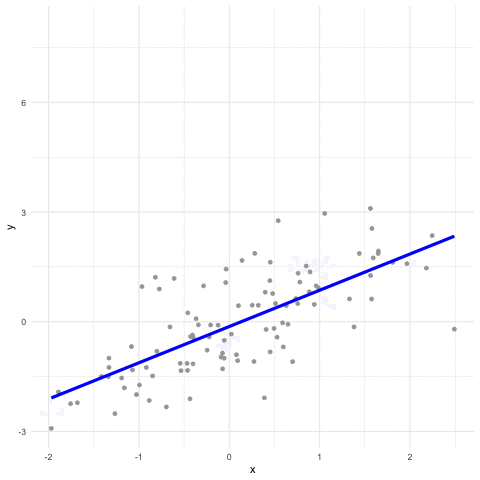
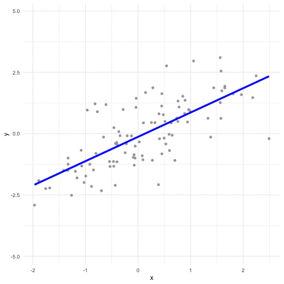
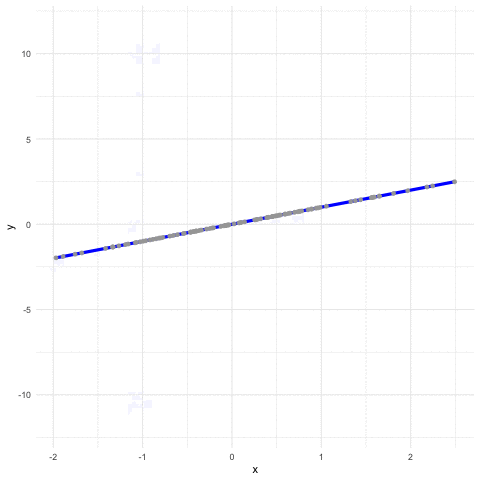

```{r loading packages, include=FALSE}
library(MASS)
library(Hmisc)
library(tidyverse) # For dplyr, ggplot2, etc.
library(magrittr) # for pipes
library(psych)
library(knitr) # For correlation tables
library(kableExtra) #for correlation tables

```

# Before we get started

*Having trouble remembering what exactly an R Markdown is? Want some more resources for learning R?*

*   Review what an R Markdown is [here](#markdown).
*   Explore further resources for learning R [here](#resources).


## Recap: What we learned in the previous tutorial

In the last tutorial, we learned a few things about group comparisons:

*   T-Tests
*   ANOVA
*   ANCOVA
*   Nonparametric tests

## Overview: What we'll learn here

Today, we'll learn about correlation and regression--the most basic methods for assessing the relationship between continuous variables and assessing the predictive power of multiple variables. We'll look at how to compute, interpret, and test the assumptions of these models.

What we'll look at here:

1. **Correlation**
- Bivariate correlation
- Partial correlation
2. **Simple regression**
3. **Multiple regression**
4. **Regression assumptions**

Lessgo!


# Correlation

**Correlation** is the degree to which two variables are related. 

**What it gives us**: The degree and direction of the linear relationship between two variables.

**Dependent variable assumption**: Strictly speaking, there is no dependent variable. Unlike group tests, there is no grouping variable for correlation, but rather two variables between which we calculate a relationship. In theory, these two variables should be continuous, but in practice, we compute correlations between pretty much any two ordered (i.e. it's clear which values are higher than others; e.g. 3 is always greater than 2) variables. 

**Other assumptions**:

1.    The relationship is linear.

**what it means**: This means that if you were to draw a scatterplot and a line of best fit for that scatterplot, it would be straight, not curved. Another way to think about it is each time variable x goes up one unit, variable y increases a constant amount. If the amount that y changed increased or decreased as x went up one unit, then the relationship would not be linear. 

2.    Observations are paired.

**what it means**: This means that for every observation on x there is a corresponding observation on y. This does **not** mean that we need to have dependent pairs as we would use in a paired t-test, it simply means that we can only compute a correlation for as many rows in our data as we have non-missing values on both variables. So, if variable x has 50 people but variable y only has 40, we will compute the correlation for the 40 people who have data on both variables. 

3.    Homoscedasticity, or homogeneity of variance.

**what it means**: This means we assume that, if we draw that scatterplot with a line again, that the points on the scatterplot are equally distributed around that line. This assumption would not be satisfied if, for example, the points were close to the line on the left side of the graph but spread out away from the line on the right side of the graph. We'll talk more about this with regression.

4.    Normality.

**what it means**: As always, normality. As with our other tests, don't worry about this too much unless we have a very small sample size.

5.    No outliers.

**what it means**: You may have noticed we haven't explicitly listed this assumption for the other tests, but it is implicit in most tests (except those robust to outliers). Outliers will always skew our estimates of the relationship, so we must get rid of any outliers to assume that the estimates we are getting from our tests approximate the true relationship in the population.


So, correlation is the linear relationship between two variables. Importantly, correlation *does not assume or equate causation*. You may have heard before (or will soon, gauranteed, in your next stats class) "correlation does not equal causation". A correlation is simply the measure of how two variables are related, without assuming that one is causing the other. To assess causation, we need other statistical methods, like regression, paired with study designs, like experiments, that are designed to isolate causal effects. 

While we would *love* to know the causal relationship between two variables, the advantage of correlation is its applicability and its accessibility: whereas we can only learn about causality for a small group of variables around which we carefully design experiments, we can learn about (and compute) correlations for almost any variable we have! This gives us a good baseline, if basic, understanding of the relationship between our variables.

But when we compute a correlation, how do we interpret whatever R gives us? We'll explore this more in a minute, but the basic is this. R will give you two things: Pearson's r and a p-value. Yay, more letters (Don't worry, there's more to come). Pearson's r is our basic correlation coefficient, and the p-value is what it always is: the proportion of times we would observe the correlation between the two variables we do (or how probable that relationship is) if the null hypothesis that there is no true relationship is true. 

Pearson's r is pretty simple to interpret. It ranges from -1 to 1, with -1 being a perfect negative relationship and 1 being a perfect positive relationship. Note that both -1 and 1 indicate a **very strong** relationship, just in different directions. If there is a positive relationship between x and y, then when one increases, the other does too; if there is a negative relationship, then when one increases, the other decreases. *No relationship* is indicated by a Pearson's r of 0. Herein, Pearson's r tells us both magnitude (how strong the relationship is; increasing in strength as it moves toward 1 or -1 and away from 0) and direction (whether the relationship is positive, moving toward 1, or negative, moving toward -1). 

*What's considered a large correlation?* Well, these standards are changing these days, but the original standards proposed by Cohen are as follows:

Pearson's *r* | Interpretation
--------------|----------------
.1            | Small
.3            | Medium/Moderate
.5            | Large


## Computing correlations in R

### Bivariate correlations

The most common type of correlations are called bivariate correlations. **Bivariate correlations** are the simple linear relationship between two ("bi-") variables ("-variate").

There are a couple common ways to compute bivariate correlations in R. Let's check them out.

First, as always, let's read in our data. As a friendly reminder, note that the data set is "cleaned", meaning that we already did the work checking for outliers, manipulating our data, and otherwise cleaning our data. Always clean your data before you play :)

```{r}
gm <- read.csv("growth mindset study_cleaned.csv")
```

Alright, the first most basic function in R to compute bivariate correlations is `cor()`. Say we're interested in the relationship between GPA and grit. For instance, does one increase as the other increases? Let's see what `cor()` gives us:

```{r}
gm %$% cor(gpa, grit)
```
Okay...it gave us one number. Is that r or p? Turns out `cor()` only gives us Pearson's r, but not a p-value. So, before we interpret anything, let's figure out what the p-value is to see if this is a significant effect.

Because `cor()` only gives us the correlation coefficient, r, let's use the function `rcorr()` in the `Hmisc` package (if you don't already have this downloaded, now is a good time!), which actually gives us both r *and* p. 

But first: this is the bane of my existence. The most confusing thing, that I get wrong. every. time. The base R function `cor()` has only 1 "r", whereas the `Hmisc` function has *2 "r"s*. Just...keep that in remembrance. 

```{r}
#install.packages("Hmisc")
#library(Hmisc)
gm %$% Hmisc::rcorr(gpa, grit)
```

OK, great. `rcorr()` Shows us the correlation between the two variables at the top of the output in the form of a matrix. Note that on the top and bottom diagonal it will always say "1.00", because it is showing the correlation between each of the variables and themselves--which is always a perfect, positive correlation. Also note that the correlation on the other diagonal is *also* the same; that's because this shows the correlation for "x and y" and "y and x"...which is the same thing. So, realize that this whole matrix is only giving you one new piece of information: the correlation between x and y. 

Also, `rcorr()` gives us the sample size for the correlation: "n= 300". This means that there were 300 complete cases that we used to compute the correlation. 

Finally, at the bottom of the output, `rcorr()` gives us the p-value (in a matrix mirroring the top of the output). Notice here that the p-value seems to be "0"...what does that mean? You can read this as "p < .001". Here, like other functions, p is normally represented in scientific notation if it's small enough, but if it's so small it's practically 0, it will just say "0". 

Wow, what a journey. Now that we know what each piece of the output is telling us, what does it mean?

Recall from above that r = .3 is generally considered a moderate correlation, whereas r = .5 is considered a large correlation. Here, we observe that there is a significant (p < .001) correlation between GPA and grit of r = .44, so, let's call it a medium-to-large correlation. This indicates that there is a pretty strong relationship between GPA and grit, such that students who tend to be higher on one tend to be higher on the other as well. 

(Just as a disclaimer since this is fake data: in real life, there is a positive correlation between GPA and grit, but it's not this large; in our data with 25K adolescents, it's about r = .21)

Okay, so `rcorr()` gave us Pearson's r and a p-value, but there is one more function we can try that gives us even a bit more information: `cor.test()`. Let's try it out:

```{r}
cor.test(gm$gpa, gm$grit)
```

Great. The format of this output is just like the output we were looking at last week with group difference testing, so we like this very much. But why is there a t-score? Just like I said last week, t-scores will come up in *everything*, so it's important to understand how they work. Here, rather than testing the difference between two groups, the t-score is the muscle behind the p-value--comparing the size of the correlation to the null hypothesis "0", to see if the effect we observed is significantly different from 0. In almost all tests we use, if you see a p-value, there's a t-test under the surface used to compute that p-value. Nice.

What else do we got?

At the very bottom, we have the actual correlation coefficient, r, under "sample estimates: cor".

Also, uniquely, `cor.test()` also gives us a confidence interval, which can be nice. However, if we are conducting many correlations at once, having too much information can be burdensome and hard to interpret, so sometimes just having r and the p-value is enough. 

Speaking of many correlations, all of these functions are fine, but they only give us *one correlation at a time*. But what if we want to create a correlation table of all or many of our variables at once?

#### Correlation tables with HARcorr()

Amazingly, this isn't something that is very easy to do in R. But fear not! I have created a function that creates correlation tables for as many correlations as you want. It also formats those tables so that they are easier to read and ready to be used for publishing or presenting your research. The function is `HARcorr()` (i.e. "Hot-and-ready" correlations) in my package `clnR2`. 

My package is on Github, not CRAN, so we need to download it a little differently:

```{r}
#install.packages("devtools") # if needed, download devtools (i.e. "developer tools")
devtools::install_github("crbwin/clnR")
```

Here's how `HARcorr` works:

1. Rather than making a concatenation to list the variables we want (e.g. c(var1, var2, var3)), we make a quosure using the `quos()` function (e.g. quos(var1, var2, var3))
2. We feed our data and our list of variables we want to correlate into the `HARcorr()` function
3. If you haven't called the `clnR2` library (I haven't), specify that `HARcorr()` comes from `clnR2` by using the code `clnR2::Harcorr()`.
```{r eval = FALSE}
q_var <- quos(age, gpa, gender_f, grit, swb)

gm %>% clnR2::HARcorr(q_var)

```

It didn't work; why? The issue is our variable `gender_f`. Even though we can put variables into the mix that aren't continuous, each variable still needs to be numeric rather than a factor variable. R can put variables coded as "0" and "1" into a correlation matrix, but it can't include "Male" and "Female". Let's recode `gender_f` into a new numeric variable, `gender`, and try again:

```{r}
gm %<>% mutate(
  gender = ifelse(gender_f=="Male", 0, 1)
)

q_var <- quos(age, gpa, gender, grit, swb)

gm %>% clnR2::HARcorr(q_var)

```

There we go. If the formatting isn't working for you (admittedly, the `kable` function sometimes has issues), you can specify the option `copy = TRUE` which strips the formatting to make it easier to copy into Excel sheets:

```{r}
gm %>% clnR2::HARcorr(q_var, copy = TRUE)
```

Notice that the first 5 rows make up the correlation table, but we have some more information after that. Oftentimes, when presenting/publishing our research, it is effective and efficient to also provide summary statistics (mean, standard deviation, and sample size) for each variable below the correlation table. That's what we've done here. For categorical variables, rather than present a mean and standard deviation, we simply present the percentage of participants that are in the group coded "1". If we only want the correlation table, we can opt out of this information using the option `describe = FALSE`. 

```{r}
gm %>% clnR2::HARcorr(q_var, copy = TRUE, describe = FALSE)
```

OK, now let's look at the actual correlation table. You may notice it looks a bit different from the correlation matrix given in `rcorr()`. Yes, we have more than one variable here, but there are few other things different, as well. Remember how in the `rcorr()` matrix there were "1.00"s along the diagonal? Since that isn't new information (each variable will always be correlated with itself), we omit those 1's on the diagonal here. Also, remember how the same correlation was present above *and* below the diagonal? That's also redundant information; we only need one side of the diagonal to see all of the correlations among all variables. So, here, we only keep the lower half of the diagonal to make it easier to look at and retain only unique information. 

Also notice that some of the correlations have asterisks next to them. This is our slick way of presenting the correlations and the p-values all in one easily viewable go (and it's industry standard). Here's how to interpret them:

stars         | Interpretation
--------------|----------------
†             | p < .10 (marginally significant)
*             | p < .05
**            | p < .01
***           | p < .001

You'll see these conventions used wherever you can find p-values.


The other options of `HARcorr` each deal with formatting your table. You can explore the other options of `HARcorr` using the code `?clnR2::HARcorr()`

```{r}
?clnR2::HARcorr()
```

### Partial correlations

Another type of correlation that is important to know is partial correlation. **Partial correlations** are the linear relationship between two variable, *controlling for* other variables. GPA and grit may be correlated, for example, but other variables may influence that relationship. GPA and grit may be correlated partially because both go up over time--that is, their relationship may be partially a function of each of their relationship with adolescents' age. In this case, controlling for age would then give us the *unique* correlation of GPA and grit, beyond their relationship with age. This can give us a more accurate estimate of the relationship between GPA and grit. 

Let's see how we can do this in R. In that both GPA and grit may differ by gender, as well, let's also try controlling for gender. Like before, gender needs to be a numeric, rather than factor variable. 

One way to do this is with the `ppcor` package, and the `pcor.test()` function (notice that it is essentially just the `cor.test()` function with `p` added to designate "partial correlation"). Here's how you would correlate gpa and grit, controlling for age and gender:

```{r}
#install.packages("ppcor")
library(ppcor)

ppcor::pcor.test(gm$gpa, gm$grit, gm[, c("age", "gender")])
```

OK, thoughts:

1.    This output, while having entirely too many decimal points is similar to what we've seen before and reveals that the correlation (r = .435) isn't much different than it was before (r = .44). This means that the variables `age` and `gender` don't play much into the relationship between GPA and grit. That makes sense, since these data are made up.
2.    That code!! I'm not even going to tell you what it means because it is ugly base R code, and that's literally what you have to write to make this work. 

Yikes. Here's another way that we can do partial correlations that is a bit better. Here, we use the `psych` package (which we use often), and utilize its `partial.r()` function. The arguments it takes are first the data, then a list of the variables to correlate, and last the variables to control for.

```{r}
gm %>% psych::partial.r(c("gpa", "grit"), c("age", "gender"))

```

OK, the code is easier, but this looks just like the `cor()` output--we don't have any p-values...why is this so hard, guys? Why can't we have nice things?

Don't worry--I gotchu.

Similar to `HARcorr()`, I've made a function for creating correlation tables for partial correlations called `corrtrol()` ("**corr**elations with con**trol**s"). This is particularly helpful when you want to see the correlations between your main variables of interest while controlling for a set of covariates or demographics. This function, however, isn't "hot-and-ready", in that it's a basic correlation table rather than an APA formatted table with descriptives. 

Say, for example, that we want to look at correlations between our outcomes, `gpa`, `grit`, and `swb` controlling for `age` and `gender`. Let's take a look at how to do this. 

`corrtrol()` is a little bit different than `HARcorr()`. It has 3 basic arguments:

1.    The data
2.    vars - input all of the variables, including control variables, in a list. Make sure that the control variables are at the end of the list. 
3.    control.vars - specifying the control variables. 

```{r}
gm %>% 
  clnR2::corrtrol(
    vars = c("gpa", "grit", "swb", "age", "gender"), 
    control.vars = c("age", "gender"))
```

Like `HARcorr`, we can turn off the formatting and get an easily copiable version using the option `copy = TRUE`:

```{r}
gm %>% 
  clnR2::corrtrol(
    vars = c("gpa", "grit", "swb", "age", "gender"), 
    control.vars = c("age", "gender"), copy = TRUE)
```


# Introduction to Regression

Regression takes the rationale and the concepts behind correlation and takes them one step further. While correlation estimates the amount that two variables co-vary, regression estimates an equation that predicts the outcome variable taking as input one or more predictor variables. As such, we will get from it an equation we can use to predict the value of the outcome variable if we know the level of the predictor variable(s).

# Single Linear Regression

Let's start with the simpler one-predictor case. Let us take our old friend mtcars to explore this. We know that a cars weight and mileage are correlated, with heavier cars being less efficient than lighter cars. We see this is true with correlational analysis.

```{r}
mtcars %$% cor(wt,mpg)
```

The two variables are correlated at r = -.87. 
Let's see the scatterplot.

```{r}
mtcars %>% 
  ggplot(aes(wt,mpg)) + 
  geom_point()
```

In the plotting tutorial, we saw we can fit a straight line that is closest to all the points. That is a line of best fit that minimizes the residuals or distance between the points and the line. What regression tells us is what is the mathematical definition of that line. 

```{r}
mtcars %>% 
  ggplot(aes(wt,mpg)) + 
  geom_point() + 
  geom_smooth(method = "lm")
```

If you recall from math class, every straight line in a plane can be defined by its intercept (where the line meets the y axis, when x = 0) and its slope (the angle the line makes with the x axis, the rise over the run). Any such line can be defined as 
$$ y = a + bx$$ where the height of any point in the line (y), equals some constant a (the intercept), plus the value of x (the predictor) multiplied by the slope (x).

Let's run linear regression on our example.

```{r}
fit = lm(mpg ~ wt, mtcars) #Reads mileage *is predicted by* weight in mtcars
fit
```

As you can see, the blue line in the above figure is mathematically defined as $$Mileage = 37.285 - 5.344*Weight$$. This can be interpreted as follows:
* Intercept = 37.285. If you had a hypothetical car that weighed 0 pounds, you would expect it to yield 37 miles per gallon.
* Coefficient = -5.344. If you increase a car's weight by 1000 pounds (1 in the wt variable), you would expect a drop of 5 miles per gallon in efficiency.

One fun thing that regression allows us to do is to predict how efficient a new hypothetical car would be, if we know its weight. Say we took a time machine back to 1974 and built a new car with those times technology, and our design ends up weighing 2462 pounds exactly. What mileage can we expect from such a car?

```{r}
predict(fit,newdata = data.frame(wt = 2.462))
```

We could expect our hypothetical car to have a mileage of 26.60. That number comes from plugging in our weight value into our equation presented above. What this is basically doing is finding the 2.462 number in the weight axis and traveling vertically until you stumble upon your regression line. See the graph below.

```{r}
mtcars %>% ggplot(aes(wt,mpg))+geom_point()+geom_smooth(method = "lm")+
  annotate(geom = "label",label = 'A',x = 2.462, y = 24.12704,size=3,shape=7,color="red")+
  annotate(geom = "text",label = '2.462',x = 2.462, y = 1,size=3,shape=7,color="red")+
  annotate(geom = "vline",xintercept = 2.462, y = 1,color="red")
```

However, as you see, not all points fall exactly on our line of best fit, meaning that our prediction is not going to be perfect. In other words, regression has an error, or residual, that has to be added to every point that accounts for the difference between the predicted values (the blue line) and the actual values (the points). Adding the error term $e$ the full regression equation is the following.
$$y = a + bx + e$$
The error terms for each row of your data frame are calculated in the regression commmand. Let's visualize them.

```{r}
resid = fit$residuals
resid
mtcars %>% ggplot(aes(wt,mpg))+
  geom_point()+
  geom_smooth(method = "lm")+
  geom_linerange(aes(ymax = mpg, ymin = mpg-resid),color="red")
```

We see red lines that show the distance between our actual values and the values that would be predicted by our regression equation. As you can see the lengths of these lines varies a bit. Sometimes our prediction is a bit off, sometimes its spot on. Sometimes we overestimate, sometimes we undershoot. The way these residuals are distributed is important, and we'll see why when we look at assumptions for regression. Linear regression fits the line that minimizes the squares of these red lines (They are squared to solve the problem of negative numbers). That is why this method is sometimes referred to as OLS (Ordinary Least Squares).

Now that we have our full regression equation, we can see what happens when we vary the three parameters of our equation, the intercept, the coefficient, and the errors.







**As a sidenote:** the predicted values by our regression equation, that is the position for each car in the blue line is available in `fit$fitted.values`.
```{r}
fit$fitted.values
```

## What about effect sizes?
As you probably know, we need some standarization to help us better interpret our models. As such, regression will give us two types of effect sizes. One for the full model ($R^2$), and one for each predictor (beta, $\beta$).

Let's start with $R^2$. It will be shown in the summary of our fit, along with other more specific statistics. Here we see that $R^2$ for our model is .7528. We interpret this as saying that our model explains 75.28% of the variance of mileage. Next to it, we see adjusted $R^2$. We normally don't report this, but it is just a way to apply a penalty for the number of predictors. The more predictors we have in our model (here we only have one, but we'll see multiple regression in a while), the larger the adjustment in the adjusted $R^2$.

As its name implies, it is the square of the correlation cofficient. In the single regression case, it is equal to the square of the correlation between the predictor and the outcome. In the multiple regression case, it is equal to the squared correlation between the fitted values and the outcome.

```{r}
summary(fit)
mtcars %$% cor(wt, mpg)
(mtcars %$% cor(wt, mpg))^2
cor(mtcars$mpg, fit$fitted.values)^2
```

Betas are effect sizes for each of the predictors. They are interpreted similar to how we interpreted the coefficient of our regression, we just change the units. While the coefficient tells us what is the change in mpg when we increase wt by 1, the beta changes those units to standardized units (i.e., standard deviations). So a beta of .2 means that an increase of 1 standard deviation on the predictor increases the outcome by 0.2 standard deviations in the outcome. They are available with package `lm.beta`.

```{r}
# install.packages("lm.beta")
library(lm.beta)
lm.beta(fit) %>% summary
```

An increase of 1 sd of weight diminshes the cars mileage by .86 times a standard deviation. Only in the single predictor case this number is equal to the correlation coefficient.

## What about hypothesis testing?

Using the summary command we again get two types of NHST (null-hypothesis significance testing). One for the model in general, and one for each predictor.

*   **Full model.** We get a F statistic with an associated p value. This tests whether the model is a significantly better predictor than the mean. In technical terms, is there a significant difference between (1) the sum of the squared residuals of the regression model, and (2) the sum of the squared differences between the mean of the outcome and each datapoint?

*   **Individual Predictors.** We get a T statistic with an associated p value. This tests if the coefficient is significantly different from 0. That is, is the slope of the line significantly different from 0? If I increase the predictor by one, will the change in the outcome be significantly different from 0?.

# Multiple Regression 

One of the main advantages of linear regression over correlation is the possibilty to work with more than a single predictor. Let's take a look at how that works.

If single regression fits a line (1D) over a plane (2D), a regression with two predictors fits a plane inside of a cube. We can still visualize that, as you can see below.

.

Moving forward from there is where things get hairy for visualization. A regression with three predictors would fit a cube inside of a tesseract (WHAT?!). And sol forth in n-dimensional space. 


Ok, sorry for that diversion, I just find that cool. Luckily, we don't need to visualize multiple regression to understand it, as the interpretation doesn't change. Let's try adding some more variables to better predict a cars mileage.

```{r}
fit2 = lm(mpg ~ wt + hp, data = mtcars)
summary(lm.beta(fit2))
```

We now build a more complex equation to better estimate the mileage of a car. Because we now have coefficients for weight and horsepower, we have a more complete equation.

$$Mileage = 37.23 - 3.88*Weight - 0.03*Horspower + Error$$

This means that a car with no weight and 0 horsepower should yield 37 miles per gallon. For every thousand pounds that the car gets heavier, it looses 3.88 miles per gallon in efficiency. For each horsepower we make the car more powerful, it becomes 0.03 miles per gallon less efficient. Again we can use this equation to predict the efficiency of a new car (say that weighs 3.425 thousand pounds, and 350 horsepower).

```{r}
predict(fit2, newdata = data.frame(wt = 3.525, hp = 350))
```

The standardized column in the `summary` of `lm.beta`, allows us to compare the effect of each predictor in standardized units. What do you think matters more for a car's fuel efficiency, its weight, or its horsepower? Based on the beta values, we can see that weight has a beta of -.63, and horsepower has a beta of -.36. Ergo, weight matters more. If we only looked at horsepower, we might be tempted to think that it is not important, since 0.03 seems like such a small number. However, if you remember that these values are scale dependent and increasing 1000 pounds is a larger change than increasing one horsepower, you can see the importance of using betas.

See what happens to the estimated coefficient for weight if we use weight in pounds, rather than thousands of pounds.

```{r}
mtcars %>% 
  mutate(wt_pounds = wt*1000) %>% 
  lm(mpg ~ wt_pounds + hp, data = .)
```

## Model comparison

Is our model any better for adding horspower? We see our new model has a $R^2$ value of .83, which is higher than that of the model that only used weight ($R^2 = .75). However is that difference statistically significant? We can test that with the `anova()` function. See below.

```{r}
anova(fit, fit2)
```

In the same way we tested that our model was significantly better than the mean to make a prediction, we can test if the sum fo squares of the new model is significantly less than that of the previous model. It is!

This means that the new variable we added (horsepower), explains additional variance to that already explained by weight. Some people would say that horsepower predicts mileage *controlling for* weight. The fact that the coefficient for horsepower is significant in the model means that when weight is held constant, increasing horsepower significantly changes mileage.

## Using categorical variables

So far, we've only worked with numerical variables. We can also work with categorical variables. Lets start with binary (0, 1) variables, which are easiest. The coefficient here is interpreted as how we expect the value of the outcome to change when we go from category 0 to category 1. For example.

```{r}
lm(mpg ~ am, mtcars) %>% summary
```

The intercept is 17.15, that is the expected mileage for automatic cars (am == 0). The coefficient is 7.25. This is the mean difference between automatic and manual cars. In other words, when we increase am by one (meaning we go from an automatic to a manual car) we can expect mileage to go up by 7.25. If we calculate means and compare them, we can see that should be the difference.

```{r}
mtcars %>% 
  group_by(am) %>% 
  summarise(mpg = mean(mpg)) %>% 
  pull(mpg) %>% 
  diff
```

The same interpretation holds when we include more predictors.
```{r}
fit3 = lm(mpg ~ wt + hp + am, mtcars)
summary(lm.beta(fit3))
```

As you can see, the value of the intercept is now 34 instead of 37. This is because the intercept now represents the mileage of a hypothetical **automatic** car with no weight and 0 horsepower. If we keep weight and horsepower constant, making an automatic car manual, improves its mileage by 2. Since that coefficient is not significant, we can say that controlling for weight and horsepower there is no significant effect of transmission type (automatic and manual cars are no different).

Wait a second! Transmission *was* a significant predictor when it was on its own.

```{r}
summary(lm(mpg ~ am, mtcars))
```
What happened? Why did we loose significance? Because the effect of transmission is not independent from the effect of weight and horsepower. As we can see in the correlations, manual cars tend to be lighter ($r = -.69$), and have less horsepower ($r = -.24$). The univariate effect of transmission is actually explained by weight and horsepower. Transmission explains no additional variance to that already explained by weight and horsepower. Hold this in the back of your mind for next week's tutorial on mediation.

What about categorical variables with more than two groups. To have that work we must dummy code that variable. This means to turn the categorical variable into a many binary variables. How many? It depends on how many categories it has. We need n-1 varaibles to fully represent a variable with n categories.

For example, in mtcars we have cars with 3, 4 and 5 gears. We can dummy-code this with two variables, say g4 and g5. If both are 0, then the car has 3 gears. If g4 == 0  and g5 == 1, the car has 5 gears. If g4 == 1 and g5 == 0, the car has 4 gears. We call 3 gears the *reference group*.

When doing regression in software of the past (ahem, cough, cough, SPSS), you have to do this manually. R however is the way of the future, so it does it for you (*as long as it is a factor variable*). Let's see how that works.

```{r}
fit4 = mtcars %>% 
  mutate(gear_f = factor(gear)) %>% 
  lm(mpg ~ gear_f, data=.)
summary(lm.beta(fit4))
```

When we only include gears, we can see that compared to a 3 geared car, four and five geared cars have significantly higher mpg. Cars with four gears are on average 8 miles more efficient per gallon, and cars with five gears are 5 miles more efficient. Note that more gears doesn't make the car linearly more efficient. Also note that we are only comparing 4 and 5 gears against three. We have no comparison between 4 and 5. A quick plot shows overlapping error bars for 4 and 5 gears.

```{r}
mtcars %>% 
  ggplot(aes(gear, mpg)) +
  stat_summary(geom="point") +
  stat_summary(geom = "errorbar")
```


# Regression assumptions

There are a number of important assumptions for linear regression--and specifically OLS regression, which we use when we use the function `lm()`. Many researchers don't test these important assumptions, and even worse, some aren't even aware of them. It's important to know *what* OLS regression assumptions are and *how* to deal with them. If you don’t satisfy the OLS assumptions, you might not be able to trust your results.

When these classical assumptions for linear regression are true, ordinary least squares produces the best estimates. However, if some of these assumptions are not true, you might need to employ remedial measures or use other estimation methods to improve the results.

Here are the seven assumptions of regression. We will use our model `fit3` to test these.

## Assumption 1: Linearity

The regression model is linear in the coefficients and the error term.

**what it means**: This means that all parameters in the model are either the constant, the error, or multiplied by an independent variable. Remember this equation from above?

$$Mileage = 37.23 - 3.88*Weight - 0.03*Horspower + Error$$
The first number is the constant, and both of the second numbers are multiplied by independent variables. Easy--this means our model is linear. Importantly, we can assess *nonlinear* lines (say Weight^2, weight squared, which would give us a quadratic line), and have the model *still be linear*:

$$Mileage = 37.23 - 3.88*Weight^2 - 0.03*Horspower + Error$$

In this case, the independent variables are Weight^2 and Horsepower--this still fulfills our criteria that each parameter (or number) is multiplied by an independent variable. 

Don't get too caught up in this, just realize that most models we'll specify--even ones with quadratic variables or interactions--will satisfy the assumption of a linear model. 

## Assumption 2: No multicollinearity

**what it means**: When two or more variables are highly correlated, they have the potential of being colinear--one variable adds very little or no new information to the model because it is so similar to another variable. **Multicollinearity** is the issue that arises when this happens in a regression model.

When the predictors in our model are very correlated this can bring all sorts of problems, not the least of which is mask a real relationship between a predictor and the outcome. One way we could get an idea about if this is a problem is to look at the correlation between our predictor variables to make sure they are not highly correlated.

```{r}
mtcars %>% dplyr::select(wt, hp, am) %>% cor %>% round(2)
```

As you can see, the correlations between predictors are .66, -.69 and -.24. In no cases are the correlations extremely large. However, a better way to test for multicollinearity is to compute the Variance Inflation Factor (VIF). This gives us a single number for each predictor that indicates how problematic is that variable from a multicollinearity standpoint. VIF values lower than 5 are desirable. It is available in the `car` package with function `vif`.

```{r}
car::vif(fit3)
```

We can see that all our variables have VIFs of less than 5. Hooray! No multicollinearity in our data!


## Assumptions about residuals

The rest of the classical assumptions of linear regression deal with the residuals of a regression which make up the models error term. 
Remember this graph from above?

```{r}
fit <- mtcars %$% lm(mpg ~ wt) %>% summary()
resid = fit$residuals

mtcars %>% ggplot(aes(wt,mpg))+
  geom_point()+
  geom_smooth(method = "lm")+
  geom_linerange(aes(ymax = mpg, ymin = mpg-resid),color="red")
```

Linear regression assumes a number of things about the attributes of these residuals (aka the error term), the satisfaction of which assumptions is important to getting accurate, unbiased estimates.


### Assumption 3: The error term has a mean of zero.

**what it means**: Random chance should determine the values of the error term. For your model to be unbiased, the average value of the error term must equal zero. If it doesn't equal zero, that means there is systematic bias where your model tends to over or underestimate the values in the data. 

This is easy to check in R:

```{r}
mean(resid) %>% round(5)
```

Rounding to 5 decimal points (just a conservative estimate), we can see the mean of the residuals is 0. This means that the regression line equally over- and under-predicts our data--it's unbiased. Perfect.

### Assumption 4: Exogeneity

The error term is not correlated with any of the independent variables.

**what it means**: Since the error term is supposed to represent random error, it should not be systematically related in any way to any of our predictors. These terms--the independent variables and the error--should be *independent*. 

We can easily check this as well:

```{r}
cor.test(resid, mtcars$wt) 
```

We can see that there is no correlation between the independent variable and the error term, satisfying the assumption that they are independent and suggesting that the error is random noise. 

### Assumption 5: Residuals are uncorrelated with each other

**what it means**: One residual should not predict the next. If a residual going up or down increases the probability that the next will go up or down, we have a problem. They should be random, and thus, unrelated. This is normally only a big problem in time series-esque data, where each data point is a new observation from the same source at a new point in time. Nevertheless, let's check it out.

First, we can visualize this using the `acf()` function:

```{r}
acf(fit3$residuals)
```

What are we looking at here? Well, each line shows the correlation between each residual and the residual before it. The residuals are uncorrelated if the lines after the first one stay within about .2 and -.2. I think our residuals are looking good, but let's check this out statistically.

We can test this statistically using a Durbin-Watson test. Like many other useful functions, the function to do this (`durbin.watson()`) is in the `car` package:

```{r}
car::durbinWatsonTest(fit3)

```
Uh-oh. The p-value is below .05, suggesting that we should reject the null hypothesis that there is no autocorrelation. So...what do we do if we *do* have autocorrelation? One thing that can solve this issue is adding the into the regression model as a predictor. Here's some code for how to do that (we'll need the package `DataCombine`):

```{r}
#install.packages("DataCombine")
library(DataCombine)

mtcars %<>% mutate(
  
  fit3_resid = fit3$residuals
) %>% slide(., Var = "fit3_resid", NewVar = "lag1", slideBy = -1)

fit3_lag <- mtcars %$% lm(mpg ~ wt + hp + am + lag1)

```
Now lets test it again:

```{r}
car::durbinWatsonTest(fit3_lag)
```

Great; adding in the lag helped solve the issue of autocorrelation (residuals correlating with each other).

### Assumption 6: Homoscedasticity

**what it means**: Homoscedasticity is a fancy word that just means constant (Homo) variance (Scedasticity). If our variance is not constant across all levels of the variable, then we can expect problems in our regression. The fastest way to get a sense of this is to look at the default ggplot. 

```{r}
mtcars %>% 
  mutate(fitted = fit3$fitted.values) %>% 
  ggplot(aes(fitted,mpg)) +
  geom_point() +
  geom_smooth(method = "lm")
```

We can see that the width of the gray 95% confidence interval retains the same width along its length. If it got wider and thinner, we would have heteroskedasticity (more variance when the gray area is larger).

The usual way in which this is looked at is by plotting residuals against fitted values and graphically inspecting patterns. We want to see no discernible pattern, rather than a bowtie or triangle pattern.


Let's take a look at the equivalent plot in our data.

```{r}
data.frame(fitted = fit3$fitted.values,
           residuals = fit3$residuals) %>% 
  ggplot(aes(fitted, residuals))+geom_point()

#The broom package provides alternatives so that you dont have to manually create these dataframes.
broom::augment(fit3) %>% 
  ggplot(aes(.fitted,.resid))+geom_point()
```

No pattern = No heteroscedasticity problems!

### Sort-of-Assumption 7: Residuals are normally distributed

**what it means**: As we know, when we fit a regression line, some residuals will be very small (the model very accurately preidcts those values), and sometimes they'll be much larger, either in the positive direction or negative direction. An assumption of linear regression is that residuals should mostly be small, and larger deviations from zero should be more and more unlikely. Finally, we expect that this distribution should be symmetrical, with similar numbers of overestimated and underestimated predicted values.

This is a "sort-of-assumption" because this assumption is not essential to obtain unbiased estimates from our regression model. However, it is important for obtaining accurate confidence intervals for our estimates, which we are just as interested in getting right as the actual regression estimates. Herein, we'll check this assumption to make sure that our residuals are roughly normally distributed.

Let's take a look at the distribution of the residuals of our model.

```{r}
fit3$residuals %>% enframe %>% ggplot(aes(sample=value))+ stat_qq() + stat_qq_line() #qqplot
fit3$residuals %>% enframe %>% ggplot(aes(value))+geom_density() #density plot
```

Along with histograms or density plots, QQ plots are a way to check if the residuals are normally distributed. The residuals are normally distributed if they follow the diagonal line in the QQ plot.

We can see the distribution is *mostly* centered around zero, with few very large deviations. There is some asymmetry, but it is not terribly off. If it went for 2 really large residuals, the distribution would look mostly normal. For a more formal test we can use a statistical test for normality such as shapiro-wilk or kolmogorov-smirnov, but bear in mind that these tests are dependent on sample size, so with large samples the smallest deviation from normality will be significant, and in a small sample the analysis will be underpowered so that every distribution, no matter how skewed will be non-significant (i.e., normal).

```{r}
shapiro.test(fit3$residuals)
```

Given that the p value is greater than .05, we would say that there is no statistically significant difference between the distribution of the residuals and the normal distribution.


# Review: End Notes

## Some useful resources to continue your learning {#resources}

A useful resource, in my opinion, is the [stackoverflow](http://stackoverflow.com/) website. Because this is a general-purpose resource for programming help, it will be useful to use the R tag (`[R]`) in your queries. A related resource is the [statistics stackexchange](http://stats.stackexchange.com/), which is like Stack Overflow but focused more on the underlying statistical issues.
**Add other resources**

## What's an R Markdown again? {#markdown}

This is the main kind of document that I use in RStudio, and I think its one of the primary advantage of RStudio over base R console. R Markdown allows you to create a file with a mix of R code and regular text, which is useful if you want to have explanations of your code alongside the code itself. This document, for example, is an R Markdown document. It is also useful because you can export your R Markdown file to an html page or a pdf, which comes in handy when you want to share your code or a report of your analyses to someone who doesn't have R. If you're interested in learning more about the functionality of R Markdown, you can visit [this webpage](https://rmarkdown.rstudio.com/lesson-1.html)

R Markdowns use **chunks** to run code. A **chunk** is designated by starting with ``` ```{r}``` and ending with ``` This is where you will write your code. A new chunk can be created by pressing COMMAND + ALT + I on Mac, or CONTROL + ALT + I on PC.

You can run lines of code by highlighting them, and pressing COMMAND + ENTER on Mac, or CONTROL + ENTER on PC. If you want to run a whole chunk of code, you can press COMMAND + ALT + C on Mac, or ALT + CONTROL + ALT + C on PC. Alternatively, you can run a chunk of code by clicking the green right-facing arrow at the top-right corner of each chunk. The downward-facing arrow directly left of the green arrow will run all code up to that point.


  
  