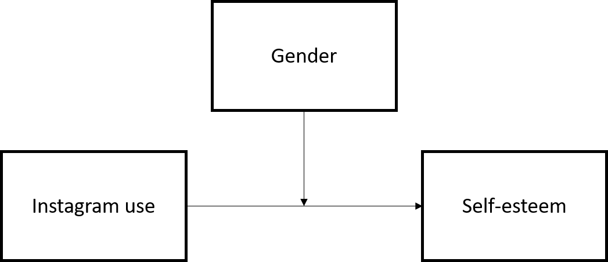
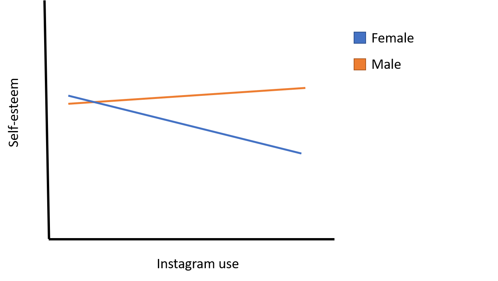
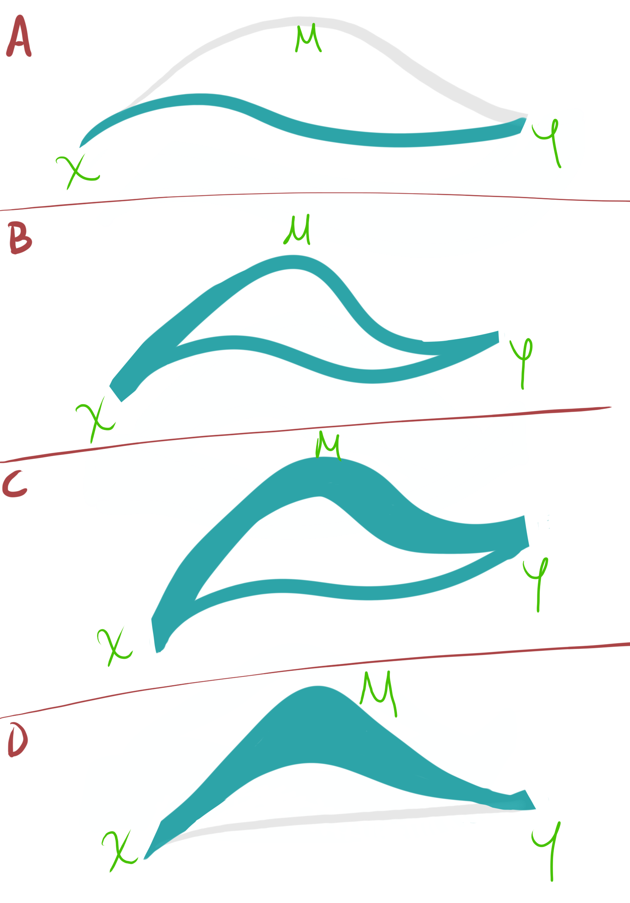

```{r loading packages, include=FALSE}
library(magrittr)
library(tidyverse)
```

# Before we get started

*Having trouble remembering what exactly an R Markdown is? Want some more resources for learning R?*

*   Review what an R Markdown is [here](#markdown).
*   Explore further resources for learning R [here](#resources).


## Recap: What we learned in the previous tutorial

In the last tutorial, we discussed correlation and regression--two ways to assess the linear relationships between two or more variables. Here's what we covered:

*   Correlation tables
*   Partial correlation
*   Regression with a single predictor
*   Regression with multiple predictor
*   Regression with categorical predictors
*   Model comparison
*   Assumptions

We learned how to assess the relationship between two variables, and how to isolate the unique relationship between those variables by controlling for other variables. 

## Overview: What we'll learn here

Many times, the questions we want to answer and the phenomena we want to observe are more complicated than a single relationship between two variables. For example, are there other factors that might affect how two variables are related, or might explain *why* two variables are related? These are common and important questions to consider, but they can't be answered with the techniques we learned last week. What we learned only allows for assessing the unique relationship between *two* variables--it doesn't allow for adding any more variables into the equation for how we understand the relationships we're observing.

This is where moderation and mediation come in. **Moderation** and **mediation** allow us to add one or more *additional* variables into the modeling of a relationship, in order to understand how other factors play into how two variables are related. In their most simple form, moderation and mediation introduce one more variable into the relationship in question. Both modeling techniques can handle introducing more than one extra variable, but using more than one moderating or mediating variable is less common (though not unheard of), because they significantly increase the complexity of the relationship and can be more difficult to interpret. With one extra variable, these techniques answer the following questions:

*   **Moderation**: How does the linear relationship between two variables `X` and `Y` *change with* different levels of a third variable, `Z`?
*   **Mediation**: Does a variable `M` explain the linear relationship between two variables `X` and `Y`?

Today, we'll learn how we can use each of these techniques, and how we can compute and interpret them in R.

What we'll look at here:

1. **Moderation**
  - Moderation using `lm`
  - Centering in moderation
2. **Mediation**
  - Mediation using `mediate`
  - Mediation using `lavaan`

Lessgo!

# Moderation

First, let's take a look at moderation:

**What it gives us**: The degree to which one variable affects the relationship between two other variables. In other words, The degree to which the effect of one variable on a second variable *depends* on a third variable. 

**Dependent variable assumption**: Moderation uses linear regression to work its magic, and thus, like linear regression, assumes a continuous outcome variable. On the right side of the equation, moderation can take continuous and/or binary variables.

**Other assumptions**:

One important assumption for moderation, mostly for the sake of interpretation, is linearity of moderation. 

**what it means**: This means the effect of `X` on `Y` changes by a constant amount as a third variable `Z` increases or decreases. It is also assumed that the `X`-`Y` relationship is linear. Herein, in order to interpret it correctly, both the moderation and the original relationship should be linear.

Otherwise, the assumptions are the same as multiple regression. Sweet.


Alright, so far we know that moderation assesses whether the relationship between two variables depends on another variable, and that in order to interpret it correctly, both the effect of the third variable on the relationship, as well as the original relationship, should be linear. We also know that otherwise, it's pretty much just regression. 

But what does it mean that a variable *affects* the relationship between two other variables, or that that relationship *depends* on the third variable?

This means that if we have two variables that are related, the way they are related *changes* depending on information from another variable. 

Take the example of gender--a variable commonly used to assess moderation. Say we have data on social media use and self-esteem for high school students and, using regression, we learn that increased Instagram use predicts lower self-esteem (ex. lm(self_esteem ~ insta, data = soc_media) %>% summary()). But, we wonder, "Does this effect hold true for everyone in our sample?" That is, does Instagram use have a different relationship with self-esteem, depending on what kind of people we are looking at? We hypothesize that gender may make a difference--maybe this effect changes depending on whether we are looking at male or female students. 

In psychology-picture-speak, this hypothesis would be visualized like this:


Very exciting, I know. As you might expect, the horizontal arrow represents Instagram use predicting self-esteem. But why does the vertical arrow point toward the first arrow? This is because moderation entails the third variable *predicting the relationship* between the first two variables: In regression-speak, if we increase the third variable (the moderator) by one unit, how does the slope of the relationship between the first two variables change?

In our example, since our moderator has only two levels (male and female), we could ask the question this way: compared to males, how does being female affect the slope of the relationship between Instagram use and self-esteem?

Let's say we do the analysis, and we find that gender *does* moderate the relationship between Instagram use and self-esteem. For male students, there is a slight positive slope, indicating that as they use instagram more, their self-esteem may go up slightly, but we aren't sure if this slope is statistically significant; moderation will tell us if there is a *difference* in slopes, but it won't tell us whether any of the individual slopes (called "simple slopes") at each level of the third variable, `Z` (i.e. gender) are statistically significant. In contrast to the slope for male students, we find that there is a negative slope for female students, indicating that as female students use instagram more, their self-esteem goes down. This can be a little hard to visualize in your head all at once, so using a graph to visualize moderation effects can be useful. Here's a graph for this moderation effect:



Of course, all moderation effects should be tested statistically, but in general, if you plot the slopes of a certain relationship by the different levels of a moderating variable, and the slopes *aren't parallel*, then you have moderation. Why? Think about it: If the slopes *are* parallel, that means that the slopes *don't change* across any level of the moderating variable--they're always the same. The moderating variable does nothing to change the relationship of the first two variables. If the slopes *aren't parallel*, then the effect *does* change (i.e. has different slopes) for different levels of the moderating variables. 

This may sound familiar to you...ever heard of an interaction? An **interaction** is where two variables *interact* to predict an outcome; in other words, the effect of one variable changes based on the level of another variable. What. Isn't that exactly what we're seeing here? Yes--in fact, the graph above would be more commonly called an "interaction plot" than a "moderation plot". So, then, what's the difference between interaction and moderation?

There is a slight difference, but before we get into it, let me be clear: they are the same mathematically. No difference. Where they *do* differ slightly is in interpretation. Moderation, as we have been discussing it, implies that we have a clear primary relationship: `X` predicting `Y`, and `Z` affects that relationship. An interaction, in it's simplest sense, doesn't necessarily assume a primary relationship--just that both `X` and `Z` are related to `Y` and they interact in how they affect `Y`. Herein, the relationship between `X` and `Y` may change for different levels of `Z` OR the relationship between `Z` and `Y` may change for different levels of `X`. It can go either way. 

In this tutorial, because we are using moderation, we *are* assuming a primary relationship, and will always refer to the third variable, `Z`, as affecting the relationship of the first two variables, `X` and `Y`. 

OK. That's enough chit-chat. Let's see how we can actually run a moderation in R.

## Moderation in R

### Moderation with a categorical moderator

Continuing with our social media example, let's see how we would actually analyze it in R. First, let's read in our data:

```{r}
sm <- read.csv("social media.csv")
```

We are interested in how gender (`female`) affects the relationship between hours/day on instagram (`insta`) and self-esteem on a self-report self-esteem index (`self_est`). Let's start with what we learned last week--to put all of these variables in the same model, we can use the following code:

```{r}
sm %$% lm(self_est ~ insta + female) %>% summary
```

As you might recall, this will give us the unique effects of instagram usage and gender on self-esteem (each effect controlling for the other variables in the model). Here, it looks like there are significant linear effects for both instagram usage and gender, such that those who use instagram more have lower self-esteem, and female students have lower self-esteem than male students (in our sample). This, however, does not tell us whether the effect of instagram use on self-esteem *is different* for male vs female students--it only tells us the independent effect of each variable. 

So, how can we test the moderaton of gender, to see if there are differential effects of instagram use across gender? It's pretty simple, actually: simply replace the `+` with an asterisk (`*`):

```{r eval = FALSE}
sm %$% lm(self_est ~ insta*female) %>% summary
```

ta da!

Before we get into the results, let's check out this syntax. The `*` is a shortcut for a longer line of code for moderation:
```{r eval = FALSE}
sm %$% lm(self_est ~ insta + female + insta:female) %>% summary
```

where `insta` and `female` represent the additive coefficients (the same as in multiple regression) and `insta:female` represents the interaction term. So, that means that when we use `*` it includes an interaction term, as well as the individual coefficients for each variable. Why does it include both? Moderation models should **always** include the individual linear effects of each variable that is in the moderation term; if we don't include those terms, the moderation term will not give us the unique, interactive effect. Rather, it will contain information on the interactive effect plus each of the linear effects. To model it correctly, we parse out each of the individual effects first, and only then add an interactive effect. Fortunately, because `*` includes both, we don't have to worry about that!

There's one other reason that `*` is a useful symbol to use, rather than the `+` and `:` symbols: it represents how a moderation is working mathematically. A moderation effect is just the two variables, `X` and `Z` (in this case `insta` and `female`), multiplied together and then added to the equation. In fact, another common way of doing a moderation is to compute the moderation variable *first*, and then add it to the regression equation, like this:

```{r eval = FALSE}
sm %<>% 
  mutate(
    instaXfemale = insta*female
  )

sm %$% lm(self_est ~ insta + female + instaXfemale) %>% summary

```

If you ran this code, you would see that it would give you the same results as previous models.

So, we can understand moderation as a *multiplicative*, rather than an *additive* effect. Multiple regression only allows for additive, individual relationships with the outcome. Moderation allows for multiplicative, multi-variable relationships with the outcome. And the shortcut R syntax `*` represents that multiplicative nature well, while also being the most concise way (least amount of code) to model moderation, too. So that's great--thanks, R :)

OK, let's return to our concise, mathematically correct code and see what results this model gives us:

```{r}
sm %$% lm(self_est ~ insta*female) %>% summary
```

Interesting. For one, we can see that the r-squared has increased to about .44 from .36 in the multiple regression model--This model seems to fit the data much better with an added interaction. It also looks like once we add the interaction to the model, the unique effect of `female` becomes nonsignificant, and the unique effect of `insta` actually *flips* to be positive. Why all this change? Well, once the variance was correctly attributed to the interaction between the variables rather than each of their linear effects, it seems that we now have a clearer picture of the true unique linear effect of each variable. This is good to remember: when we model regressions, we get the unique effect of each variable *controlling for the other variables in the model*, not anything we haven't included, such as potentially important interaction terms. 

Now let's look at the interaction/moderation term: it looks like it is significant. But what does it mean?? Well, moderations are notoriously difficult to interpret, so it always helps to visualize the relationship with a graph. But before we do that, let's take a stab at trying to understand it. 
Remember that we said we can think of the interaction term `Z` as predicting the relationship between `X` and `Y`. So, then, the coefficient we get here, -2.70, is not telling us how many units the outcome `Y` will change between male and female students, but rather how much the effect of `X` on `Y` will change. So, if it is -2.70, that means that the slope for female students will be 2.7 lower than that for male students. And, because the effect of `insta` on `self_est` has been parsed out for female students, the `insta` coefficient now represents the baseline effect, that is, the effect for male students, of instagram usage on self-esteem. All of this information together suggests that `insta` and `female` interact, such that there is a slight positive effect of `insta` for male students, but a negative effect for female students. So, in the end, what is the effect of instagram use on self-esteem? It depends! (whenever you hear the words "it depends", you can be pretty sure we're talking about moderation)

It can be much easier to interpret these results, though, if we visualize them. How can we visualize moderation? There are a number of ways we can visualize moderation in R, but for our purposes, let's use the `interact_plot` function from the `interactions` package. This is a really easy-to-use function that uses ggplot2 to visualize our model. First, we run our moderation model, then we feed the model into the `interact_plot` function. The three arguments for `interact_plot` are:

1.    the data
2.    the predictor, `x`
3.    the moderator, `z`

```{r}
# install.packages("interactions")

mod1 <- sm %$% lm(self_est ~ insta*female)

interactions::interact_plot(mod1, "insta", modx = "female")

```


As you can see, the slopes for male and female students clearly deviate, with the male slope increasing, and the female slope decreasing. Also, graphs like this make it very easy and clear to interpret the meaning of the interaction.

We can improve the readability of our graph by adding a few labels:

```{r}

interactions::interact_plot(mod1, "insta", modx = "female",
                            modx.labels = c("Male", "Female"),
                            legend.main = "Gender",
                            y.label = "Self-Esteem",
                            x.label = "Instagram Use (in hours)")

```

Here, `modx.labels` changes the labels for each level of the moderator variable; `legend.main` changes the label for the legend of the moderator variable; and `y.label` and `x.label` change the labels for the x and y axes, respectively. 

While not always necessary, especially when just using visualization for our own interpretation, adding a little extra effort into the graph to make it more readable is great for presenting, and easy to do with `interact_plot`, since it uses `ggplot2`. 

### Moderation with a continuous moderator

We can see that with a few lines of code, we can analyze, visualize, and interpret moderation with categorical variables, like gender. This is relatively easy--we are comparing a small number of slopes, such as the slope for male students vs the slope for female students. But can we use a continuous variable as a moderator? 

Say, for example, that we think that grit predicts GPA, but we're not sure if the relationship between grit and GPA is the same for everyone. One reason we might suspect that it's not is that grit is defined as passion and perseverance for *long-term goals*, which younger students may not yet have. Additionally, even if younger students do have grit, it may be more difficult to see the direct effect of their grit on GPA, as it may manifest by persistent, increased studying over a long period of time, even years. So, we want to see if age moderates the effect of grit on GPA: Does grit have a different effect on GPA depending on how old the students are? Let's check it out.

First, let's read in our data:

```{r}
grit <- read.csv("HS grit.csv")
```

now let's specify our moderation model:

```{r}
mod2 <- grit %$% lm(gpa ~ grit*age)

summary(mod2)

```

We can see that each of our coefficients are significant, indicating that there is evidence for effects of grit and age, as well as a moderating effect of age on the relationship between grit and GPA. 

The moderation term is positive--.10. As we learned in the last model, this coefficient is not in terms of GPA (i.e. this does not mean GPA is increasing by .10), but rather in terms of the slope of the relationship between grit and GPA. With that clarified, we can interpret this as we would any other continuous variable: a unit (aka one year) increase in age corresponds to a .10 increase in the slope of the effect of grit on GPA. 

Also remember that the interpretation of the `grit` coefficient also changes when we add a moderation term. Now, it can be interpreted as the effect of grit on GPA when the moderator, age, is 0. That doesn't make a whole lot of sense, though, because...who's 0 years old? That's not a very meaningful number. We'll circle back to this issue in a second.

We can also visualize our model to better make sense of this interaction. Because we don't have discrete categories like gender, we can't simply graph the moderation in the same way we did before. One way to visualize the effect of this third variable on the relationship of the other two is using a three dimensional graph--a cube grid with three axes, x, y, and z, rather than a square grid with two axes, x and y. As you might expect, this solution doesn't necessarily help interpretation and it's difficult to visually tell whether there is a moderation because we won't have the characteristic overlapping/non-parallel slopes. 

A common solution is mimicking categorical variable moderation by plotting slopes for the values at +/- 1 SD of the moderating variable. The rationale behind this approach is that it shows us what the relationship between `X` and `Y` is at "high" and "low" levels of the moderator. This way, we can get a sense of how the relationship changes over the range of values on `Z`. 

`interact_plot` makes this easy: with sharp attention to detail, it detects when our moderating variable is continuous and adapts the graph to show slopes for +/- 1 SD of the moderator, as well as a slope at the mean of the moderator. 

Check it:

```{r}
interactions::interact_plot(mod2, "grit", modx = "age")
```

Here we can see, consistent with our prediction, that for younger students, grit isn't very related to GPA. However, it more positively predicts GPA as students get older.

### Mean centering 

We've learned how to assess categorical and continuous moderators, but we need to consider one more thing to complete our mastery of moderation.

The astute statistician may be wary of our moderation models up to this point. Why? Because, being well aware that linear regression assumes no multicollinearity (high correlation) between variables, they are suspicious of the fact that we added information from the same variables into our model twice. For example, with our last model, we added information from `grit` and `age` in as individual predictors, but also when we added the `grit*age` interaction. Regression doesn't work well when we add multiple variables that include very similar information--it becomes very difficult to identify the unique effects of each variable. Is too-high-correlation a problem here, though? Let's see: First, let's create our interaction term and then see how much it correlates with each of our predictors.

```{r}

grit %<>% mutate(
  
  gritXage = grit*age
)

grit %>% 
  select(grit, age, gritXage) %>% 
  as.matrix() %>% 
  Hmisc::rcorr(.)

```

Yikes. It looks like `grit` and `gritXage` are correlated at r = .95; this means they carry almost identical information. What should we do, then? Should we abandon the moderation because of the potential of multicollinearity? 

Not necessarily. One common way to avoid this problem is to mean center our variables. This means that we take each score for each individual, and subtract the mean from that score. The resultant centered variable gives the mean the value of 0, Positive values are those scores above the mean, whereas negative value are those scores below the mean. 

Once we mean center our variables, the rank info is the same (i.e. those who had high scores before still have high scores and vice versa), but they are no longer highly correlated to the moderation term. 

To mean center easily, we can use the function `scale` while specifying `scale = FALSE`. I know, it's confusing, but this makes sure that we mean center on the original scale of the variable, rather than scaling the scores to z-scores. We create mean-centered variables for each predictor, as well as the interaction.

Here's how we do it:

```{r}
grit %<>% mutate(
  
  grit_c = scale(grit, scale = FALSE),
  age_c = scale(age, scale = FALSE),
  gritXage_c = grit_c*age_c
) 
```

Let's see if this solved our problem:

```{r}
grit %>% 
  select(grit_c, age_c, gritXage_c) %>% 
  as.matrix() %>% 
  Hmisc::rcorr(.)
```

Nice--this reduced the correlation between the individual predictors and the moderation term to practically zero. 

```{r}
mod2_c <- grit %$% lm(gpa ~ grit_c*age_c)

summary(mod2_c)
```

We can see that the estimates are quite different--are our results completely different now that we've centered?? The numbers are, yes, but they represent the same data and same relationships, just mean-centered. This, in turn, does change the interpretation. 

The `grit*age` interaction is exactly the same, however, and the interpretation doesn't change--for a 1 unit (year) increase in age, the slope of grit predicting GPA increases by .10. The grit coefficient is drastically different because it represents the effect of grit on GPA when age is 0--and we have moved our 0. Now, since we have mean-centered, 0 represents the mean. So, the grit coefficient can be interpreted as the effect of grit on GPA at the mean age, making it much more interpretable. 

If we look at the plot again, we see that the slopes haven't changed--our effects are the same, we have just manipulated how our variables are expressed (by mean-centering) to reduce multicollinearity and ease interpretation of some coefficients. 


```{r}
interactions::interact_plot(mod2_c, "grit_c", modx = "age_c")

```


# Mediation

Mediation analysis look at the question of whether the effect between a predictor and an outcome is explained by an intermediary variable. Let's take a closer look.

## What is (and what isn't) mediation

Imagine you observe that certain intervention (say asking people to take notes using pen and paper vs. on a laptop) produces an increase in learning. This could be represented the following path model.


After runnig this experiment, we might be interested in understanding why this is. Maybe when people take notes manually, they tend to translate the information in their own words, rather than copying textually from the lecture. Maybe the amount of verbatim text is a good proxy for the depth with which students are processing the information, and *that* is what explains the effect. This would be visualized in the following way.


Mediation, then, is the statistical technique that allows us to answer these sorts of questions. If we corroborate our hypothesis, we would say that the effect of analog note-taking on learning is mediated (or explained) by the fact that students copy less text verbatim.

Mediation is vital for explanation. To explain a phenomenon means to provide a cause that accounts for it. Even better, a more complete explanation provides a causal chain, linking the phenomenon with proximal causes, and explaining these proximal causes by more distal ones. Mediation is a statistical tool that allows us to look at these causal links. In statistical parlance: It allows us to know that the relationship between an independent variable (X) and the dependent vairable (Y) is explained by a mediator (M).

All this talk about causality might make you think that the use of certain statistical techiniques allows you to prove that X *causes* Y. This is a common misconception. Causality is adressed by experimental desing, NOT by statistics. If we want to say that someting causes something else, we must make sure that at least three conditions are met:

1. The cause precedes the consequence.
2. The cause and the consequence co-ocurr, they are correlated.
3. Alternative explanations can be ruled out.

I could collect self-report data on trait neuroticism, state anxiety, and a current diagnosis of an anxiety disorder crossectionally and propose the following model.


However, without longitudinal data that shows what came first, without a way to rule out reverse causality and alternate explanations, we shouldn't be so quick to assume causality just because we have a fancy statistical model and a pretty picture to go with it! Maybe the existence of a disorder increases state anxiety and makes people self report their traits differently. Maybe there is a different cause, say genetic in nature, that explains the three collected variables.

So always remember, when conducting or reading research that uses mediation, make sure that there are good reasons to assing each variable as a predictor, criterion or mediator.

## The traditional way to do mediation and Sobel tests

In 1986 [this paper](https://scholar.google.com/scholar_lookup?hl=en&volume=51&publication_year=1986&pages=1173-1182&author=+Baron%2C+R.+M.author=+Kenny%2C+D.+A.&title=The+moderator-mediator+variable+distinction+in+social+psychological+research%3A+Conceptual%2C+strategic%2C+and+statistical+considerations) came out, clarifying the distinction between moderation and mediation and laying out the requirements that need to be met to say that there is a mediation effect.

1. The predictor should predict the outcome. In our `lm` framework, we would say `y ~ x`.
2. The predictor should predict the mediator. `m ~ x`.
3. The mediator should predict the outcome, even after controlling for the predictor. `y ~ m + x`.
3.1 The effect of x is lessened by the inclusion of m. Sobel's test tells you if this reduction is significant.
4. Finally, inverting the regression, we should see that our outcome does *not* predict our predictor, controlling for the mediator `x ~ y + m`.

If all these conditions are met, Baron & Kenny (1986) would say we have a mediation effect. Depending on how much the effect of `y ~ x` is diminished when the mediator is added `y ~ x + m`, we would determine if the mediation is total or partial.

1. Total mediation implies that *all* of the relationship between x and y is explained by the mediator.
2. Partial mediation implies that *not all* of the relationship is explained by the mediator.

Picture a stream of water. Say you are standing at one point and you can see how much water is flowing. Further down the stream, you can see that the water is still flowing. However, you notice that part of the water you see is diverted to a secondary stream that flows back into the first. It could be that none of the water goes into this secondary stream (No mediation). Maybe some, but not all of the water goes through the secondary stream (Partial mediation), Maybe between point A and B the main stream is absolutely dry, and actually all the water is going through the secondary stream (Full mediation).



Instead of using Sobel Tests, we will use bootstrapping and 95% confidence intervals, which have been shown to work better for two reasons. They have better power, and are less affected by non-normal distribution. [This](https://www.youtube.com/watch?v=jJ-Q-cCrE44) video can show you how this is done in R in case you stubbornly want to use this outdated method.

## Bootstrapped confidnece intervals: a better approach

What is bootstrapping? It's a statistical technique that allows you to see if your results are significant with fewer assumptions. Usually it is done to avoid the problems that non-normality can bring to some analyses. Here's the logic behind it.

1. Select a random sample **with replacement** from your data. This implies that some cases might be selected more than once, and some others might not be selected at all.
2. Calculate whatever you're interested in in this new sample. It could be a mean, or in this case, our regression estimates.
3. Repeat the procedure with 1000 (or any other large number) of random samples.
4. Look at the distribution of the statistic in your bootstrapped sample, and calculate its 95% confidence intervals.
5. If the 95% confindence intervals do not include 0, we can say there is a significant effect.

Here's how you do it in the `mediate` package. We will use the jobs dataset that is included in the package. It has data from a randomized field experiment in which unemployed people recieved an intervention to help them find jobs in order to improve their mental health outcomes and to help them find jobs. We hypothesize that this effect is mediated by increased self-efficacy for job-seeking.

1. Run (and save) regressions separately for the mediator (`m ~ x`) and the outcome (`y ~ x + m`)

```{r}
#install.packages("mediation")
library(mediation)
head(jobs)

data = jobs 

b <- lm(job_seek ~ treat, data) # x predicts the mediator
c <- lm(depress2 ~ treat + job_seek, data) # x and m predict the outcome.
```

2. Calculate the direct and indirect effects for each of the 1000 random samples and look at the 95% confidence intervals.

```{r}
mediation <- mediate(b, # Mediator model
                    c, # Outcome model
                    sims=1000, # Number of bootstrap samples
                    boot = T, # Ask for bootstrapped confidence intervals
                    treat="treat", # Name of the x variable
                    mediator="job_seek" # Name of the m variable
                    )
summary(mediation)
```

How do we interpret this:
- ADE: Average Direct Effect. This is the direct effect `c'`. The coefficient of x in the regression `y ~ x + m`
- ACME: Average Causal Mediation Effects. Is the indirect effect, that is how much of the direct effect of `y ~ x` is actually going through `m`. In our diagrams, it is equal to `a*b` or `c - c'`
- Total Effect: The sum of the ACME and ADE. In our diagrams, it is equal to `c = c' + a*b`
- Prop. Mediated: Proportion of the indirect to the total effect. It is equal to `a*b/c`.

In this case, we can see that the *p* values show that the results are not significant, and our 95% confidence intervals include 0, suggesting that there is not a significant mediation effect.

3. Looking at a plot might help intepret these better. If the horizontal line (the confidence interval) intersects the vertical line (0), then the effect is not significant.

```{r}
plot(mediation)
```

### Practice. Mediation with covariates.
Follow the same procedure, but include economic hardship, sex, and age as covariates. To do this, simply run the same code as above, but include `age`, `sex`, and `econ_hard` in both the outcome and mediator model. Also, just to be safe, use 2000 rather than 1000 bootstrapped samples.

```{r}

```

It seems like adding these covariates does not make the effects significant.

## Mediation in `lavaan`

Another way to run mediation is to use package `lavaan`. This package allows you to run path models and structural equation models, which are very useful for many reasons. Among them are:
- You can estimate multiple regressions simulteously
- You can estimate custom parameters and test them for significance
- You can run confirmatory factor analysis and use the latent variables generated in the system of equations. 

We wont go into much detail here, but it is nice to start getting familiarized with this package and its syntax, because you will likely use it if you move into these sorts of analyses.

lavaan's `sem()` function works pretty much in the same way as `lm()`. We first specify the model (akin to lm's formula) and then provide the data.

Here are the operators:

| Operator |    Definition    |   Example  |                  Reads                 |
|:--------:|:----------------:|:----------:|:--------------------------------------:|
|     ~    |    Regression    |    y ~ x   |           y is predicted by x          |
|    ~~    |    Covariance    |   y ~~ x   |            y and x correlate           |
|    ~~    |     Variance     |   y ~~ y   |       estimate the variance of y       |
|    ~ 1   |     Intercept    |    y ~ 1   |       estimate the intercept of y      |
|    =~    |      Loading     |   y =~ x1  |           y is measured by x1          |
|    :=    | Define parameter | c := a * b | c is defined as the product of a and b |

For mediation we will care primarily for the regression and parameter defining operators. The full model goes in between single quotes (').

Here is the general simple case model skeleton for mediation.
```{r}
Model = ' # Outcome Model: y is predicted by x and m
             Y ~ c*X + b*M
           # Mediator Model: m is predicted by x
             M ~ a*X
           
           # Define parameters  
           # indirect effect (a*b)
             ab := a*b
           # total effect
             total := c + (a*b)
         '
```

Alternatively you can use a standard text editor (e.g. Notepad), to write your models, save them as a txt file and read it with read-lines.

Let's run the same example as above using lavaan.

```{r}
#install.packages("lavaan")
library(lavaan)
Model = ' # Outcome Model: y is predicted by x and m
             depress2 ~ c*treat + b*job_seek
           # Mediator Model: m is predicted by x
             job_seek ~ a*treat
           
           # indirect effect (a*b)
             ab := a*b
           # total effect
             total := c + (a*b)
         '
fit = sem(
  Model,          # Our text model
  jobs,           # Our data set
  se="bootstrap"  # So we get bootstrapped standard errors
)

summary(
  fit,         # Our model
  std=T,       # To get standardized coefficients (betas)
  rsquare=T    # To see how much variance is explained in each of the regressions
)
```

In the summary we get a lot of information! There are three important sections to look at after the header with sample size, estimator information, and other miscellaneous info:
- Regressions: We get the estimates and betas for each regression in the model. We see that only `job_seek` predicts `depress2`.
- R-Square: We get how much variance is explained for the mediator and the outcome. We explain 6.5% of the variance in `depress2` and 0.2% of the variance in `job_seek`
- Defined Parameters: We get our estimates of the indirect effect (`ab`) and the total effect. Looking at the `P(>|z|)` we can see that neither of these is significantly different from zero.

A look at the confidence intervals, available in the `parameterestimates()` function, shows the same story.

```{r}
parameterestimates(fit)
```

### Practice. Mediation with covariates.
As in the prior example, write out the syntax for a model that includes `age`, `sex`, and `econ_hard` as covariates.

# Comparing mediation and moderation.
While mediation looks at intermediate effects and causal chains, moderation shows that the relationship between x and y depends on the level of the m variable. In short: moderation answers when or for whom; mediation answers how or why.

Technically, moderation is done by running regression with a mulitplicative term between two predictors. Moderation is done by comparing results from two nested regression models.

Compared to simple regression where we simple have predictors and outcomes, mediation and moderation  have the advantage of modelling variables in three different ways. Whenever you encounter a problem, try to think about whether you are asking a mediation question (what is the mechanism?) or a moderation question (When does this hold?).

# Review: End Notes

## Some useful resources to continue your learning {#resources}

A useful resource, in my opinion, is the [stackoverflow](http://stackoverflow.com/) website. Because this is a general-purpose resource for programming help, it will be useful to use the R tag (`[R]`) in your queries. A related resource is the [statistics stackexchange](http://stats.stackexchange.com/), which is like Stack Overflow but focused more on the underlying statistical issues.
**Add other resources**

## What's an R Markdown again? {#markdown}

This is the main kind of document that I use in RStudio, and I think its one of the primary advantage of RStudio over base R console. R Markdown allows you to create a file with a mix of R code and regular text, which is useful if you want to have explanations of your code alongside the code itself. This document, for example, is an R Markdown document. It is also useful because you can export your R Markdown file to an html page or a pdf, which comes in handy when you want to share your code or a report of your analyses to someone who doesn't have R. If you're interested in learning more about the functionality of R Markdown, you can visit [this webpage](https://rmarkdown.rstudio.com/lesson-1.html)

R Markdowns use **chunks** to run code. A **chunk** is designated by starting with ``` ```{r}``` and ending with ``` This is where you will write your code. A new chunk can be created by pressing COMMAND + ALT + I on Mac, or CONTROL + ALT + I on PC.

You can run lines of code by highlighting them, and pressing COMMAND + ENTER on Mac, or CONTROL + ENTER on PC. If you want to run a whole chunk of code, you can press COMMAND + ALT + C on Mac, or ALT + CONTROL + ALT + C on PC. Alternatively, you can run a chunk of code by clicking the green right-facing arrow at the top-right corner of each chunk. The downward-facing arrow directly left of the green arrow will run all code up to that point.


  
  