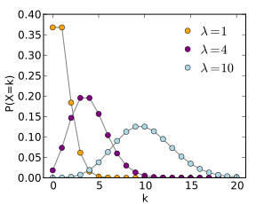

```{r loading packages, include=FALSE}
library(tidyverse) # For dplyr, ggplot2, etc.
library(magrittr) # for pipes
```

# Before we get started

*Having trouble remembering what exactly an R Markdown is? Want some more resources for learning R?*

-   Review what an R Markdown is [here](#markdown).
-   Explore further resources for learning R [here](#resources).

## Recap: What we learned in the previous tutorial

In the last tutorial, we learned a few things about mediation and moderation, two very useful techniques to multivariatly assess the relationships between variables.

-   Mediation looks at questions of mechanism, while moderation looks at when is an effect stronger or milder.
-   We used functions mediate and lavaan to run mediation
-   We used `lm()` to run moderation analyses.
-   We learned why we need to center our predictors
-   We saw how to plot these two statistical methods.

## Overview: What we'll learn here

Daadadada dada dadadada DAA DAAADADAAADAAA DAADAADAADAADADA DAAAAAAA DAAAADAAAAAA DA da DAAAAA - IT'S THE FINAL WORKSHOP!!!!

(IMAGINE THAT WAS TO THE SONG THE FINAL COUNTDOWN). If you don't know that song, check it out [here](https://www.youtube.com/watch?v=9jK-NcRmVcw)!

So far, our approach at regression has assumed that we are working with well-behaved, continuous, normal variables. We now turn into certain situations where regular regression won't work, such as binary outcomes and count data. Aka poorly behaved :)

What we'll look at here:

1.  **When/why regular regression won't work**
2.  **Regression with binary outcomes: logistic regression**
3.  **Poisson regression**
4.  **Negative binomial regression**

Let's get started.

# When/Why regular regression wont work

Regular regression makes no special assumptions on how the outcome variable works. It has the full catersian coordinate system to work with: the response variable can take any value between $-\infty$ and $+\infty$. A standard linear regression could make a prediction of -24.34, +34.555555, $\pi$, 99999, and so on.

While this is **definitely** useful, it is not always realistic. Sometimes, our outcome variable is not a continuous variable. Lets see some examples.

1.  We want to predict whether or not a student will graduate, based on her SAT score. Graduation, or not, is a binary variable, that is it is either `TRUE` (1), or `FALSE` (0). Ultimately, this means that the regression will predict a probability from 0 - 1 that a student will graduate. For the purpose of this exercise, I we will generate SAT scores distributed around 1300 just to visualize a regression. I randomly made up this regression (pretend it's real): 

$P(gradation) = \beta_0 + \beta_1 \times SATscore$ where $\beta_1 = .3$ and $\beta_0$ is determined through a sample.

```{r}
set.seed(123)
data_frame(SAT = rnorm(200,1300,100),
           grad = .3*SAT + rnorm(200)) %>% 
  mutate(grad = ifelse(grad > mean(grad),1,0)) %$% 
  lm(grad ~ SAT) %>% 
  broom::augment() %>%
  mutate(Range = ifelse(.fitted < 0 | .fitted > 1, "P(grad) outside [0,1]","P(grad) inside [0,1]")) %>% 
  ggplot(aes(SAT,grad))+
  #annotate("rect",xmin = 0,xmax = 1,ymin = 0,ymax = 1,alpha = .3)+
  geom_point(aes(col=Range))+
  geom_smooth(method = "lm") +
  geom_vline(xintercept = 1185,linetype="dotted") +
  geom_vline(xintercept = 1425,linetype="dotted") +
  geom_vline(xintercept = 1600,linetype="dashed", color = 'green') +
  geom_vline(xintercept = 1100,linetype="dashed", color = 'green')
```
hmmmmmmm, so what do we see here? It looks like that the dotted lines indicate when the probability of graduating is equal to zero (SA ~ 1185) and when the probablity of graduating is equal to 1 (SAT ~ 1425). But, the line is also making predictions that are below 0 and above 1!! What does this mean? Well, at SAT = 1600 (green dashed line on right), our regression is predicting that the probability of graduating is roughly 1.75! Then, at SAT = 1100 (green dashed line on left) our regression is predicting that the probability of graduating is roughly -0.4. If your thinking that probabilities must ALWAYS be between 0 and 1, then you're correct! This is a limitation of linear regression - it is inherently a line, so it can't take into account the real-world fact that probabilities have to be between 0 and 1!

How do we solve this problem? There are actually many ways to fix this, but I will just show you a few like logistic regression, which basically forces all the predictions of our regression between 0 and 1. Specifically, it fits a special S- shaped curve that can never exceed 0 or 1.

Here is another scenario were linear regression wouldn't work:

We want to predict the amount of times a student raises his hand during a lesson. This is a count variable, and as such, it has two important characteristics that differentiate it from normal regression. It can not take negative numbers (It wouldn't make sense for the model to predict -2 participation in class), and it can only take integer values (Nobody can participate 3 *and a half* times). We use Poisson regression to solve these sorts of data conundrums.

There are a number of different special models to model specific data types. I hope this section has convinced you that linear regression (sadly) cannot be a panacea that solves all of our data problems.

# Logistic Regression

Like we described above, we may need to use different types of regression models when we have dependent variables that are not continuous. When our dependent variable is binary (i.e. two categories), we use a type of regression called **logistic regression**. In the case of a binary variable, our regression will predict the PROBABILITY that the outcome happens.

Why's it called "logistic"? And how does it work?

Before we get to that, let's re-visit why it's even necessary - just to drive home the point.. Logistic regression is necessary because using normal linear regression--which gives us linear, continuous predictions--doesn't make sense when the outcome is either 0 or 1. As we pointed out in the previous section, beside just being illogical to try and put two distinct categories on a linear line, linear predictions can give us predicted values below 0 and above 1. These predictions aren't interpretable because they are outside the range of possible values.

So, to solve this problem, statisticians have created a regression line that is squished between 0 and 1. Here's a comparison between linear and logistic regression:


What does this "squished" regression line look like? As you can see above, it is an S-curve that accelerates quickly and then decelerates (i.e. flattens out) as it approaches 1. This curve helps us make more accurate, interpretable predictions of binary dependent variables.

In order to get this S-curve to keep the predicted values between 0 and 1, we take the *log of the odds*, the odds being defined as the probability of getting a 1 over the probability of getting a 0. Now, at this point, don't get too worried about the distinction between odds and probability, just recognize that we have to use a **log function** - $\log(x)$ to get the right curve to model between 0 and 1--hence the name "logistic" regression. Also, this means that once we compute our logistic regression, the regression coefficient we get represents the log odds.

OK, let's try this out in R and see what we get! WAHOOOOOO

First, let's read in our data:

```{r}
cwb <- read_rds("cwb_399_logistic.rds")
```

We are interested in whether grit predicts if adolescents have a part-time job or not.

`grit`, as always, is a continuous grit score between 1 and 5. `job` is 0 if the student doesn't have a part-time job and 1 if they do. So, our regression is looking to predict the probability that a student has a part time job based on great. We will use a logistic regression as discussed earlier. 

Here's what it looks like in R:

```{r eval = FALSE}
#using piping
cwb %$% glm(job ~ grit_8, family = "binomial") %>% summary

#individual calls - uncomment to see
#fit1 <- glm(job ~ grit_8, family = "binomial", data = cwb)
#summary(fit1)
```

Not so bad, right? One line of code!  As you can see, we use the same format as linear regression (DV \~ IV), but with the function `glm()` instead of `lm()`. Also, notice we have this `family =` argument. Why do we need that? As you'll see in later sections, `glm()` is actually the function we use for many types of regression that deviate from linear regression. So, to let R know which of those types we want to use, we have to specify the type of distribution (or "family" of distributions, hence the name) for our model. Here, because we are doing *binary* (i.e. two options only - 0 or 1) logistic regression, we use the argument `family = "binomial"`. Do note that you do have to quote the input for this argument.

Awesome. So, how we specify logistic regression models in R isn't very different from linear regression, and the output isn't either. Let's check it out and compare them!

```{r}
#linear regression
cwb %$% lm(job ~ grit_8) %>% summary

#logistic regression
cwb %$% glm(job ~ grit_8, family = "binomial") %>% summary
```

We can see the output is familiar, but uses a few new terms and the values are legitimately different!. You can see where we would normally have info on our residuals we have *deviance residuals*--this is calculated differently from residuals in linear regression, but uses the same principle: with our estimation of the regression, we are trying to minimize the residuals. You might also notice that it says "Dispersion parameter for binomial family taken to be 1". Instead of the trying to mo minimize the residuals to a line, we are minimizing to the S-Shaped crurve!, Also, we'll talk more about *dispersion parameters* later--they are more important for Poisson models. For now, don't worry about these terms too much. Instead let's focus on the coefficient of our effect.

It looks as though the effect of grit on whether adolescents have part-time jobs is significant, as represented by the very, very small p-value. The coefficient for this effect is 0.3296 for logistic regression.

Great. And what does that mean?

Well, for linear regression were the coefficient is 0.049, wee would interpret this as "on average, a one unit increase in grit score is associated with 0.049 percentage point increase probability of having a part time job. As we mentioned earlier, this doesn't really work because if we keep adding or subtracting 0.049 we will break zero or one - a mathematical impossibility.

How about logistic regression? What's the 0.3296 stand for. Welp.....

...I don't know. And pretty much no one else does either. I mean they do know, but it's not easy to wrap ones head around!

Why? Because this coefficient of grit_8 in the regression, is the log of the odds of getting a 1 vs. getting a 0. If you remember, we took the log of the odds to fit the curve between 0 and 1, but this transformation is not intuitive or easy to interpret. Here's how the log of the odds is computed:

$b = log(odds_{hasjob}) – log(odds_{nojob})$

This is a little bit different than b in linear regression, which represents rise/run, or $frac_{Y}{X}$. This is again because we took the log of the odds. If you search the recesses of your memory, you may recall that when you take the log, division turns into subtraction. So, 

$b = log(odds_{hasjob}) – log(odds_{nojob})$ 

is equivalent to

$b = log(\frac{odds_{hasjob}}{odds_{nojob}})$

So, the coefficient is not all that different from linear regression--before taking the log it looks pretty similar. After taking the log, though, it's not easily interpretable. 

In our model, a one unit increase in X means an increase of .3296 in the log of the odds. Yeah. We're not even going to try and figure out what that means.

So, what do we do?

To interpret the coefficient, we need to get rid of the log transformation. Once we do, we end up with our measure of effect size: an **odds ratio**.

## Odds Ratios

An **odds ratio** is the ratio of the odds of getting a 1 over the odds of getting a 0:

$OR = \frac{odds_{hasjob}}{odds_{nojob}}$

You'll notice this is exactly the same as our equation above, except without `log()`. This is much more interpretable. In a second, we'll interpret the odds ratio for our data. 

But first, how do we get rid of `log()`? Again, reach deep into the recesses of your mind and recall that the reciprocal of the logarithmic function is the exponential function. Sooo if we exponentiate the log of the odds, we end up with the odds ratio. Boom! 

So, in sum: In order to accurately model regression models with binary outcomes, we need to squish the prediction line to be between 0 and 1. We can do that by taking the log of the odds. This gives us a coefficient that represents the increase in the log of the odds given a one unit increase in X. Because this is not easily interpretable, we exponentiate the log of the odds, getting rid of the log function, and leaving us with a ratio of the odds of getting 1 to the odds of getting 0: the odds ratio. 
In short, do some funky transformations to model your regression correctly and then get rid of those funky transformations to make it interpretable. Not too bad. This is confusing and hard - honestly, it's not totally comprehendable by just reading my words on this page! If you truly want to understand logistic regression (also sometimes called logit) - you should take psych stats or econometrics :). Finally, if you want to just know the actually formula for a logistic regression next to a linear regression. Here you go! Then, we'll get back to R

Linear Regression formula:
$y = \beta_0 + \beta_1X_1 + \beta_2X_2 + ... + \beta_nXn$

Logistic Regression formula:

$y = \frac{e^{\beta_0 + \beta_1X_1 + \beta_2X_2 + ... + \beta_nX}}{1+e^{\beta_0 + \beta_1X_1 + \beta_2X_2 + ... + \beta_nX}}$


Let's check it out with our model. Here's what we did before:

```{r}
mod1 <- cwb %$% glm(job ~ grit_8, family = "binomial")
```

Now, to get the odds ratio, we just have to exponentiate (put to the e power) the coefficient from our model. Basically, for each coefficient, we are doing this: $e^{\beta_i}$. In R, we can do that using the `exp()` and `coef()` functions:

```{r}
exp(coef(mod1))
```
So, what does this mean? We can interpret it directly as the odds rather than as the log of the odds: on average, a one unit increase in grit associates with the odds of having a job being 1.39 times higher than not having a job. That's a mouthful!

Unlike a normal regression, where a coefficient of 0 indicates "no effect", a coefficient of 1 indicates "no effect" for odds ratios. Why? "1" means that the odds of having a job or not having a job are the same; a person is no more likely to have one than not have one. Why is this? because multiplying any numver by 1 is the same as adding 0 - nothing happens! Our logistic regression coefficient is a multiplier times the odds.

Because 1 means "no effect", an odds ratio higher than 1 means the odds are higher that a person has a job, and an odds ratio lower than 1 means the odds are higher that they don't have a job. While we get very explicitly interpretations from linear regression, logistic regression tends to be more amorphous. A value of the coefficent that's HUGE means a large effect, very negative is an inverse effect, and close to 1 is no effect. We can also always look at the statistical significance too. This is a lot of info, which is great, but the cost of logistic regression is interperetability

# Poisson regression

Poisson regression lets us work with count outcomes (remember the example of how many times a student raised their hand?). As we saw, these are characterized by three important distinctions: 1. they cannot be negative. 2. they are not necessarily normally distributed. 3. they are only discrete values. The following figure shows three Poisson distribution with different values for the gamma parameter. As you can see in the figure, the distribution is represented with discrete points, and the lines are there just as aids in visualization. This is our regression line - another squishing like logistic regression, but it's a funkier squish!



How does poisson regression solve these problems? It uses a log link function. This means that instead of predicting the response variable itself, we predict its log.

In other words, while normal regression has the form:

$$ y = \beta_0 + \beta_1X_1 + \beta_2X_2+...+\beta_nX_n$$

poisson regression has the form:

$ ln(y) = \beta_0 + \beta_1*x_1 + \beta_2*x_2+...+\beta_n*x_n$ or its equivalent $ y = e^{(\beta_0 + \beta_1*x_1 + \beta_2*x_2+...+\beta_n*x_n)}$ 

Assumptions

1.  The outcome variable is count data. This means: no negative numbers, no decimals.
2.  Independence: Observations should be independent of each other
3.  The distribution of counts follows a poisson distribution. If observed an expected counts are similar, then this assumption is satisfied.
4.  The mean and the variance are equal. This is called equidispersion. When this doesn't hold, a negative binomial model works better.

## An example

Let's model the number of scolarship offers (the counting number) a highschool baseball player gets depending on their division (A, B or C) and their SAT score (scaled from 0 - 100)

Here's the data

```{r}
#make this example reproducible
set.seed(1)

#create dataset
data <- data.frame(offers = c(rep(0, 50), rep(1, 30), rep(2, 10), rep(3, 7), rep(4, 3)),
                   division = sample(c("A", "B", "C"), 100, replace = TRUE),
                   exam = c(runif(50, 60, 80), runif(30, 65, 95), runif(20, 75, 95)))

view(data)
```

**Practice**

Use HARcorr, describe, summarize and/or ggplot to get a sense of what the data look like. Here are some questions to look for. What is the range of offers students get? What is the mean SAT score for each amount of offers. What is the mean amount of offers for each division?

```{r}
#practice!
```

Fitting the poisson model is simple. Instead of `lm()` we use `glm()` and set `family = "poisson"`. We use the same formula syntax as in logistic regression and `lm()`. As you can see fitting the model is very similar to how you would fit a logistic regression model. We can start to see here that `glm()` is very nifty! It's going to be a great friend of yours in R :)

```{r}
#fit the model
model <- glm(offers ~ division + exam, family = "poisson", data = data)

#view model output
summary(model)

```

We get a familiar looking table of coefficients, with estimates, SEs, z-values (rather than t-values), and their corresponding *p* values. How are the estimates interpreted? Remember that poisson regression logs the outcome. This means that the estimates tell us what happens to the log-count of the variable when the predictor is increased by 1 (as in `lm`). For example, the only significant coefficient in on exam = .09. This means that on average, 1 point increase in the exam is associated with an increase of scholarship offers by .09 of the log(count).

An easier way to interpret this is to get rid of the log by exponentiating the estimates.

```{r}
coef(model) %>% exp()
```

Now we can interpret our estimates as likelihoods. We now see that the exponentiated coefficient for exam is 1.09. This means that a 1-point increase in the exam is associated with a 9 increase in the probability of receiving another scholarship.

The coefficients on binary predictors (dummy-coded divisions) are interpreted similarly: compared to being in division A (our reference group), being in division B, on average, is associated with a 7% increase in the probability of getting another scholarship. The number for division C is 31%. Note that these coefficients are **not significant** though.

### What is deviance and AIC?

You may have noticed that, as opposed to `lm()`, we don't get an F-statistic testing the whole model, nor an $R^2$ value. We do however,  get two relevant things, that *sorta* do the same thing.

Akaike Information Criterion, AIC, is a measure of model fit with two important charactersitics:

1.  They test parsimonious model fit: That is to avoid overfitting, they have a penalty for more complicated models. Basically, is the number of predictors helpful versus the predictive power that they provide.
2.  They are not interpretable by themselves. They are only useful to compare models drawn from the same data.

Ah! If you're wondering... Lower values are good. Larger values are bad! In short, don't worry too much about AIC - just remember lower is better if you're comparing two models.

Residual deviance, on the other hand, can be used in a similar way to an F-Test to assess model fit. However, we have to run a $\chi^2$ test specifying the degrees of freedom. Here's the code.

```{r}
pchisq(model$deviance,model$df.residual,lower.tail = F)
```

We get a p value of .83, which is larger than the cutoff of .05. This means that the model fit is adequate. Remember we are looking for *differences* between the model and the data, so a non-significant result means that there is correspondence between the model and the data.

### Plotting

Here is a way to plot the model. We will use `broom::augment` to access the fitted values (the values our model predicts), and we will use those to plot our model. We will plot raw data points as, well points, and our model as a line. To visualize our model, we must exponentiate the fitted values so they are correctly scaled.

**Practice:** Add axis labels to the plot.

```{r}
broom::augment(model) %>% 
  ggplot(aes(exam,offers,col = division))+
  geom_point(position = position_jitter(height = .15))+
  geom_line(aes(y = exp(.fitted)))
```
That is one sexy plot! Really let's us see how both division and exam score matter.

### Testing assumptions

To test for equidispersion, look at the mean and the variance of the response variable to check they are roughly equal.

```{r}
mean(data$offers)
var(data$offers)
```

We can conduct a formal test for equidispersion using the `dispersiontest()` function in the `AER` package.

```{r}
#install.packages("AER")
library(AER)
dispersiontest(model)
```

Here we can see that our data is equidispersed (p > .05). There is no difference between them!

# Negative binomial regression

What if the data is **over-dispersed**: that is the variance of the data is greater than the mean? Then, we would violate one of poison regression's key assumptions. If we ran regular-old-fashioned poisson regression, our results would be biased.

Luckily, we have a model that is basically poisson regression with an added parameter to model the dispersion in the data. This is a negative binomial model. We can do this using a very simple syntax. We just need to use `glm.nb()` from the `MASS` package instead of regular `glm`.

Let's try and run a negative binomial model on the `nb` dataset. We will use gender, mathematics achievement (`math`) and program type (`track`) to predict the number of days absent (`daysabs`).

```{r}
#install.packages("MASS")
library(MASS)
nb <- read_rds("NB data.rds")
```

First, let's make sure a negative binomial model is actually needed. Remember that we use NB models when the equidispersion assumption is not met. What was equidispersion again? That the mean and the variance are somewhat equal. 

**Practice:** Use the `mean()` and `var()` command to judge equidispersion in this data. Hint: use the outcome variable.

```{r}


```

We can fit a poisson model, and feed that into the `dispersiontest()` function to formally test equidispersion.

```{r}
nb %$% glm(daysabs ~ math + gender + track, family = "poisson") %>% dispersiontest()
```

Here we see that p < .05, meaning that the data is significantly overdispersed. ERGO, we need a negative binomial model! Here's how to run it.

```{r}
#fit the model
model.nb <- glm.nb(daysabs ~ math + gender + track, data = nb)

#view model output
summary(model.nb)
```

As you can see, the resulting model is very similar to the poisson model output, with one extra parameter: The Theta Parameter. All this number does is model the overdispersion of the data, removing the assumption that the dispersion = 1 required by poisson regression.

As with all models so far, exponentiating the coefficients aids in interpretation. All our odds ratios are lower than 1, meaning that all these variables have a *negative* effect on the outcome variable. Increasing one point in a math test is associated with a diminshed probability of missing an extra day by around 1%. Being male, is associated with the likelihood of missing an extra day reducing by ~19%. Remember, if the exponentiated coefficient equals 1, then that means that there is **no change.**

```{r}
exp(coef(model.nb))
```

**Practice:** Modify the code for the poisson figure, to make a figure for this model. Hint: remember to change the variable names. Hint2: If the lines look chunky, its because you must plot both categorical variables in the plot. I suggest plotting one in the color aesthetic and the other based on faceting. Hint: If all else fails, see the last chunk of this markdown.

```{r}

```


# Review: End Notes
What you learned today
1.  **When/why regular regression won't work**
2.  **Regression with binary outcomes: logistic regression**
3.  **Poisson regression - counting outcomes**
4.  **Negative binomial regression**

## Hidden Chunk

```{r}
broom::augment(model.nb) %>% 
  ggplot(aes(math,daysabs,col = gender))+
  geom_point(alpha = .5)+
  geom_line(aes(y = exp(.fitted)))+
  facet_wrap(~track)+
  theme_linedraw()+
  theme(legend.position = "bottom")+
  theme(panel.grid = element_blank())+
  labs(title = "Negative Binomial Model",
       x = "Math Test Score",
       y = "Days Absent",
       col = "Gender")

#You can also use linetype to solve the double categorical variable problem.
broom::augment(model.nb) %>% 
  ggplot(aes(math,daysabs,col = track,linetype = gender))+
  geom_point(alpha = .2)+
  geom_line(aes(y = exp(.fitted)))+
  theme_linedraw()+
  theme(legend.position = "bottom")+
  theme(panel.grid = element_blank())+
  labs(title = "Negative Binomial Model",
       x = "Math Test Score",
       y = "Days Absent",
       col = "Gender")

#Here's how you would ad 95% confidence intervals along the predicted values line.
broom::augment(model.nb,se_fit = T) %>%  #SE adds standard errors
  #We multiply by the z values for 2.5 and 97.5% (roughly +-1.96) to get the high and low values for the CI
  mutate(high = .fitted - qnorm(.025)*`.se.fit`,
         low =  .fitted + qnorm(.025)*`.se.fit`) %>% 
  ggplot(aes(math,exp(.fitted),col = track,fill= track))+
  geom_line()+
  facet_wrap(~gender)+
  geom_ribbon(aes(ymin = exp(low),ymax = exp(high),col = NULL),alpha = .2)
  
```

